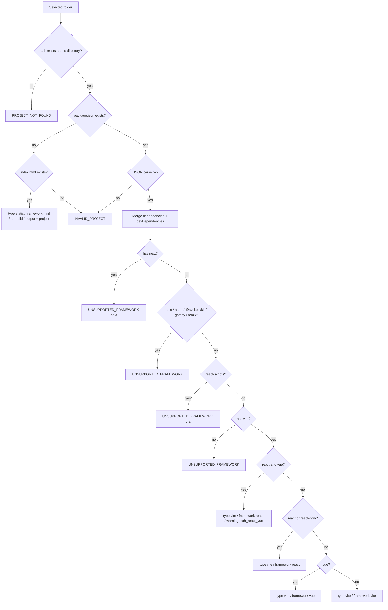
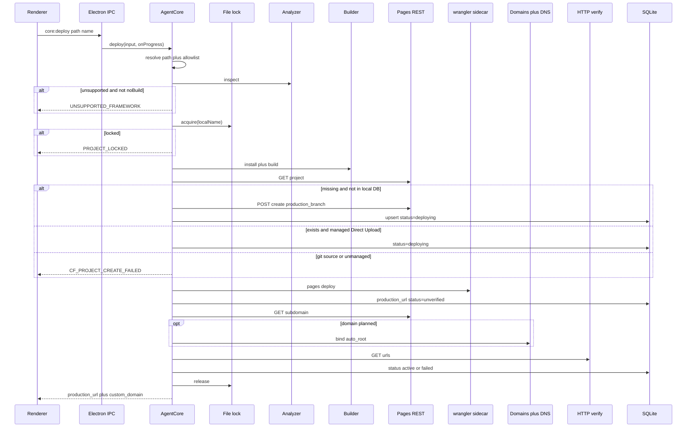
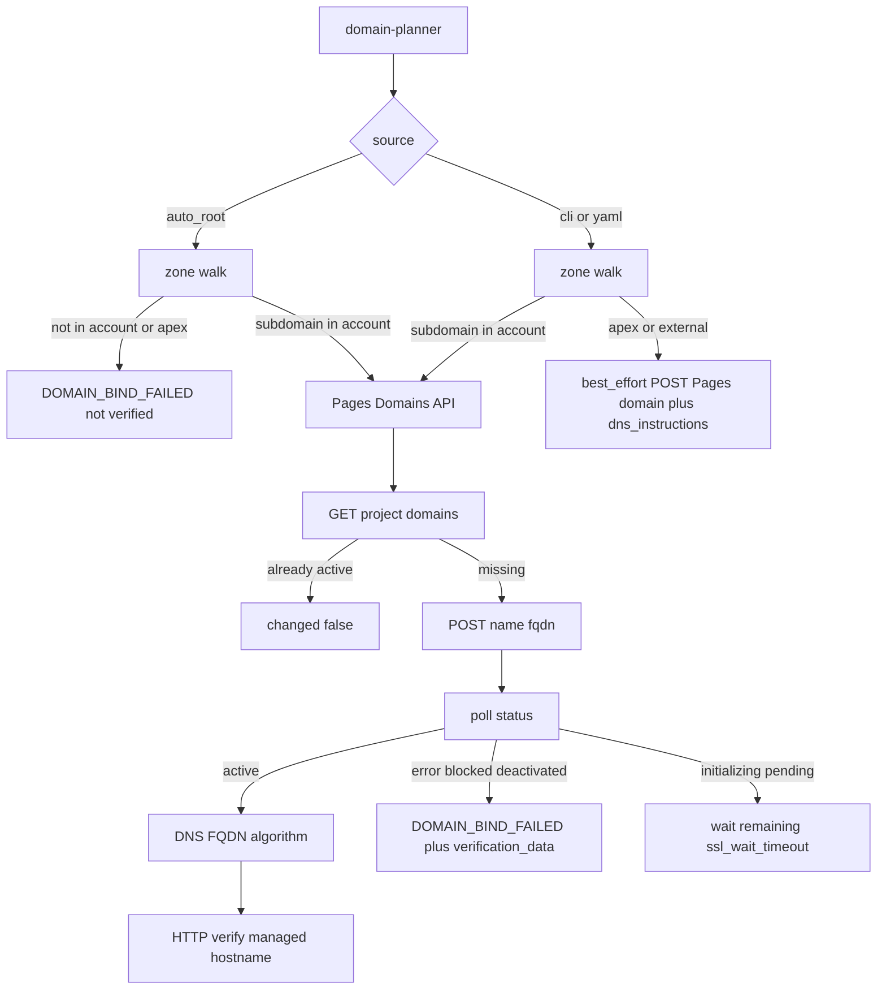

# CF Nexarch 工程设计文档（Control Plane R4）

| 字段 | 值 |
| --- | --- |
| 文档标题 | CF Nexarch Engineering Design |
| 作者 | Ryan / CF Nexarch |
| 日期 | 2026-08-22 |
| 状态 | Draft — Control Plane R4 |
| 读者 | 从零实现该工具的工程师；后续 CLI / Agent / MCP 的契约维护者 |
| 仓库现状 | Greenfield。当前工作区以规格与设计文档为主 |
| 产品形态 | Windows 绿色免安装桌面软件；GUI 是首要入口，未来 CLI / MCP 共用同一 Core |
| 产品定位 | **Cloudflare 本地控制台 + 多资源管理器 + 一键部署器 + Agent 控制层** |

## 修订历史

| 版本 | 日期 | 说明 |
| --- | --- | --- |
| Draft-CLI | 2026-08-21 | CLI-first 设计，建立 Pages 部署、域名、JSON、锁、SQLite 等基础规则。 |
| Draft-Full-Merge-R3 | 2026-08-21 | 改为 Windows Electron 绿色软件；补充 sidecar Node/Wrangler、GUI、IPC、打包。 |
| **Draft-Control-Plane-R4（本文）** | **2026-08-22** | 产品从 Pages 部署器升级为 Cloudflare 本地控制台。引入 Account Sync、统一 Resource 模型、Project↔Resource 关系、External/Managed 资源、Capability、Policy Engine、多服务 Dashboard。Pages 仍为第一种完整 Deployable Adapter；Workers 提前；D1/KV/R2/DNS 等先 Discover/Inspect，再逐步 Manage。 |

### 冲突裁决

本文顶层架构优先于 R3 的 Pages-centric 结构。R3 中已经审查成熟的以下规则继续有效，但其作用域收缩为 `PagesAdapter` 或共享基础设施：

- Electron 安全边界、preload 白名单原则。
- Token 不进 renderer / YAML / SQLite / 日志。
- sidecar Node + extraResources Wrangler，不依赖用户 Node/Git。
- Pages Direct Upload、项目创建 REST、`production_branch`、自定义域名状态机。
- DNS 不覆盖未知 A/AAAA/CNAME；`auto_root` 不得假绿。
- HTTP 验证、操作日志、correlation id、路径白名单、deploy 锁。
- 干净 Windows 打包冒烟。

若旧附录中的字段、Phase、`Platform = "cloudflare-pages"`、`list()` 语义与本文冲突，以本文为准。

---

# 1. Overview

CF Nexarch 是运行在用户 Windows 电脑上的 **Cloudflare 本地控制台**。用户解压 zip、双击 exe 后，可以看到当前 Cloudflare 账户中的资源，查看状态、编辑支持的配置、将本地项目部署到 Cloudflare，并把多个 Cloudflare 服务组织到一个逻辑 Project 中。

它不再只回答“怎样把一个 Vite 项目传到 Pages”，而要回答四类问题：

1. **我 Cloudflare 账户里现在有什么？**
2. **这些资源现在是什么状态？**
3. **我能在这里安全地编辑/管理哪些配置？**
4. **我能否从本地项目一键创建、关联并部署这些资源？**

GUI 是 V1 主入口。未来 CLI、AI Agent、MCP 均只调用相同的 Core / Adapter / Policy，不复制业务逻辑。

## 1.1 产品对象

系统有五个一级概念：

```text
Account
  ├─ Project (本地逻辑分组，可选)
  │    ├─ LocalSource
  │    └─ ProjectResourceLink ──→ Resource
  │
  └─ Resource (Cloudflare 真实资源)
       ├─ Pages Project
       ├─ Worker
       ├─ D1 Database
       ├─ KV Namespace
       ├─ R2 Bucket
       ├─ Zone / DNS Record
       ├─ Queue
       └─ future resource types
```

**Project ≠ Pages Project。**

一个 Project 可以包含多个 Cloudflare 资源，例如：

```text
weather
├─ LocalSource: F:\AI\weather
├─ Pages: weather-web
├─ Worker: weather-api
├─ D1: weather-db
├─ KV: weather-cache
├─ R2: weather-assets
└─ Domain: weather.example.com
```

## 1.2 Cloudflare 是远端事实来源

SQLite 不再被视为 Cloudflare 状态的真相数据库。

```text
Cloudflare API (authoritative)
        ↓
     Sync Engine
        ↓
 SQLite local cache + local metadata
        ↓
      Renderer
```

本地库负责：

- 快速启动与离线缓存；
- LocalSource / Project / ResourceLink；
- CF Agent 自己的部署记录与操作日志；
- Agent Policy；
- 上次同步时间与远端快照；
- 资源是否由本工具创建/纳管。

远端存在/删除/修改的最终判断，以 Cloudflare live sync 为准。

---

# 2. Product Principles

## 2.1 Read broadly, write explicitly

Cloudflare 账户中原本存在、不是本工具创建的资源也必须显示。

资源具有：

```ts
type ResourceOwnership = "managed" | "external";
```

- `managed`：本工具创建或用户明确纳入管理；可能有本地源码、部署配置、历史与 Project 关联。
- `external`：Cloudflare 已存在，但本地没有完整管理上下文。

`external` **不是只读**。用户可以编辑，但高风险操作需要 Policy Engine 提升确认级别。

## 2.2 Capability over all-or-nothing support

一个资源类型不需要等“全部功能完成”后才出现在 UI。

统一能力：

```ts
type ResourceCapability =
  | "discover"
  | "inspect"
  | "create"
  | "update"
  | "delete"
  | "deploy"
  | "logs"
  | "bindings"
  | "secrets"
  | "objects";
```

例如早期：

| Resource | Discover | Inspect | Manage | Deploy |
| --- | --- | --- | --- | --- |
| Pages | Yes | Yes | Yes | Yes |
| Workers | Yes | Yes | Partial→Yes | Yes |
| D1 | Yes | Yes | Partial | N/A |
| KV | Yes | Yes | Partial | N/A |
| R2 | Yes | Yes | Partial | N/A |
| DNS | Yes | Yes | Yes | N/A |
| Queues | Yes | Yes | Later | N/A |

## 2.3 Human UI first, Agent-safe by construction

GUI 应让普通用户完成多数任务；Agent 不获得一套更危险的旁路 API。

所有写操作都经过：

```text
Input validation
    ↓
Resource Adapter
    ↓
Policy Engine
    ↓
Confirmation / authorization decision
    ↓
Cloudflare write
    ↓
Immediate targeted re-sync
```

## 2.4 No silent destructive reconciliation

同步发现差异时，只更新“观察到的状态”，不自动修复。

例：

- 本地记录有 Pages，但 Cloudflare 已被手工删除 → 标 `remote_missing`，保留 LocalSource，允许重新部署。
- Cloudflare 新出现 Worker → 自动显示为 `external`，不自动绑定到某个 Project。
- 名称相似的资源 → 可以建议关联，不自动关联。

---

# 3. Scope & Roadmap

## 3.1 Phase 1 — 可用的 Cloudflare 控制台 + Pages 完整链路

必须交付：

### Desktop / Account

- Windows x64 绿色 zip，干净机无需 Node/npm/Wrangler/Git。
- 首次向导：API Token、Account、初始工作区；域名/Zone 不再限制为唯一一个 `domains.root`。
- 当前 Account 自动同步。
- 页面明确展示同步时间、缓存状态、API 错误。

### Inventory

至少 Discover/Inspect：

- Pages
- Workers
- D1
- KV
- R2
- Zones / DNS

若某 API 在实现阶段受权限或 API 稳定性限制，可降级为“不可用 + 原因”，不得伪造空列表。

### Projects

- 创建本地逻辑 Project。
- 绑定一个或多个 LocalSource。
- 手工关联/解除关联 Cloudflare Resource。
- 可将 `external` Resource 纳入 `managed`。

### Pages

保持 R3 的完整 Pages 能力：

- static HTML / Vite / React+Vite / Vue+Vite 分析与构建。
- Direct Upload。
- 自定义域名。
- live status / verify。
- redeploy。
- delete。
- deployment history 的本地记录；Cloudflare live history 视 API 可用性同步。

### Workers

Phase 1 至少 Discover/Inspect；若 PR spike 顺利，可在 Phase 1 后半加入 deploy MVP，但不得阻挡 Pages V1。

## 3.2 Phase 1.5 — Workers 一等支持

- Worker 从本地目录一键部署。
- Routes。
- compatibility date / flags。
- vars。
- bindings 基础管理。
- secrets 写入/覆盖/删除；不假装读取原 secret 明文。
- logs 基础入口。
- delete。

## 3.3 Phase 2 — 资源管理扩展

- D1 创建/删除/基本管理。
- KV namespace 与 key/value 管理。
- R2 bucket 与对象浏览/上传/下载/删除。
- DNS 完整管理。
- Queues 基础管理。
- 多资源 Project 模板化部署。

## 3.4 Phase 3 — Agent / CLI

- `cf-agent.cmd`。
- JSON output。
- Resource/Project 命令。
- Agent Policy 生效。
- 自动化常用安全写操作。

## 3.5 Phase 4 — MCP + 高级 Cloudflare

- MCP 工具映射。
- Durable Objects。
- Hyperdrive。
- Vectorize。
- 更复杂 Workers bindings / observability。

---

# 4. V1 Acceptance

V1 不再只验“部署 calculator”。必须同时验证“Cloudflare 控制台”与“Pages 部署器”两条路径。

## 4.1 干净机启动

一台无 Node/npm/Wrangler/Git 的 Windows x64 机器：

1. 解压 zip。
2. SmartScreen 允许后双击 exe。
3. 完成 Token / Account 向导。
4. Dashboard 打开，立即可显示本地缓存；首次无缓存则显示同步骨架/状态，不白屏。
5. Cloudflare API 同步完成后显示至少 Pages 与 Worker 实际资源数量。

## 4.2 External resource visibility

账户中预先创建一个不是本工具创建的 Pages/Worker。

验收：

- 必须显示；
- `ownership = external`；
- 可打开详情；
- 支持的安全编辑操作可以执行；
- destructive edit 必须经过 Policy/确认。

## 4.3 Pages 一键部署

在无 Node/npm/Wrangler/Git 环境选择 fixture：

- static HTML，或
- npm Vite / React+Vite / Vue+Vite。

完成：

```text
inspect → install/build → create/read Pages → upload → bind domain(optional) → verify → sync
```

部署完成后：

- Resource Inventory 立即出现/刷新对应 Pages Resource；
- 若属于 Project，Project 页面出现 Resource link；
- live 状态与 URL 正确；
- 不依赖重启应用。

## 4.4 Out-of-band change

在 Cloudflare Dashboard 手工修改或删除一个资源。

CF Nexarch 下一轮 sync 后必须反映：

- updated / remote_missing；
- 不静默重建；
- 不删除本地 Project/LocalSource。

---

# 5. Core Domain Model

## 5.1 Account

V1 UI 只激活一个当前 Account，但数据库与接口保留多 Account。

```ts
interface AccountRecord {
  id: string;                 // local UUID
  provider: "cloudflare";
  remoteAccountId: string;
  name: string | null;
  isActive: boolean;
  lastSyncedAt: string | null;
}
```

Token 按 account credential key 存 Windows Credential Manager。若 V1 最终只允许一个 token，也不得把 schema 写死成 singleton。

## 5.2 Project

```ts
interface ProjectRecord {
  id: string;                 // local UUID; canonical local identity
  name: string;
  description: string | null;
  tags: string[];
  accountId: string;
  createdAt: string;
  updatedAt: string;
}
```

Project 是本地组织概念，不要求 Cloudflare 有同名对象。

## 5.3 LocalSource

```ts
interface LocalSourceRecord {
  id: string;
  projectId: string;
  path: string;
  role: "frontend" | "worker" | "fullstack" | "assets" | "other";
  framework: string | null;
  buildConfigJson: unknown;
}
```

一个 Project 可以有多个 LocalSource。

## 5.4 Resource

```ts
type ResourceKind =
  | "pages_project"
  | "worker"
  | "d1_database"
  | "kv_namespace"
  | "r2_bucket"
  | "zone"
  | "dns_record"
  | "queue"
  | "durable_object"
  | "hyperdrive"
  | "vectorize";

interface ResourceRecord {
  id: string;                 // local UUID
  accountId: string;
  kind: ResourceKind;
  remoteId: string;           // Cloudflare API identity
  name: string;
  ownership: "managed" | "external";
  remoteStatus: string | null;
  remoteUpdatedAt: string | null;
  lastSyncedAt: string;
  syncState: "fresh" | "stale" | "remote_missing" | "error";
  metadataJson: unknown;      // normalized + adapter-specific non-secret metadata
}
```

**禁止把 secret value 写进 `metadataJson`。**

## 5.5 ProjectResourceLink

```ts
interface ProjectResourceLinkRecord {
  projectId: string;
  resourceId: string;
  role: string | null;        // frontend/api/database/cache/assets/domain/...
  linkedBy: "user" | "agent" | "import";
  createdAt: string;
}
```

相似命名只允许产生 suggestion，不自动生成 link。

## 5.6 Deployment

Deployment 不只为 Pages 保留。

```ts
interface DeploymentRecord {
  id: string;
  projectId: string | null;
  resourceId: string;
  localSourceId: string | null;
  provider: "cloudflare";
  kind: "pages" | "worker";
  status: "running" | "succeeded" | "partial" | "failed" | "cancelled";
  remoteDeploymentId: string | null;
  productionUrl: string | null;
  startedAt: string;
  finishedAt: string | null;
  correlationId: string;
  errorCode: string | null;
}
```

---

# 6. Resource Adapter Architecture

## 6.1 Adapter contract

```ts
interface ResourceAdapter<TSummary = unknown, TDetails = unknown> {
  readonly kind: ResourceKind;
  readonly capabilities: ReadonlySet<ResourceCapability>;

  list(ctx: AdapterContext): Promise<TSummary[]>;
  get(ctx: AdapterContext, remoteId: string): Promise<TDetails>;
  normalizeSummary(input: TSummary): NormalizedResource;
  normalizeDetails(input: TDetails): NormalizedResourceDetails;
}
```

可选能力采用独立接口，不做万能 `updateResource(any)`：

```ts
interface CreatableAdapter<TCreate> {
  create(ctx: AdapterContext, input: TCreate): Promise<ResourceMutationResult>;
}

interface UpdatableAdapter<TPatch> {
  update(ctx: AdapterContext, remoteId: string, patch: TPatch): Promise<ResourceMutationResult>;
}

interface DeletableAdapter {
  delete(ctx: AdapterContext, remoteId: string): Promise<ResourceMutationResult>;
}

interface DeployableAdapter<TDeploy> {
  deploy(ctx: AdapterContext, input: TDeploy, onProgress?: ProgressHandler): Promise<DeploymentResult>;
}
```

## 6.2 Adapter registry

```ts
ResourceRegistry
├─ PagesAdapter
├─ WorkersAdapter
├─ D1Adapter
├─ KVAdapter
├─ R2Adapter
├─ ZoneAdapter
├─ DNSAdapter
└─ QueueAdapter
```

未知/暂未实现类型不得导致整个 sync 失败。

## 6.3 PagesAdapter

R3 已完成大量设计，继续使用：

- REST：项目创建/读取/域名/DNS/状态。
- Wrangler：Direct Upload。
- Analyzer/Builder。
- Verify。
- Domain state machine。

但返回对象必须映射到新的 `Resource`/`Deployment`，不再让 Pages schema 成为全局 schema。

## 6.4 WorkersAdapter

Workers 必须与 Pages 独立，不通过 `Platform` 枚举硬塞。

目标能力：

```text
discover
inspect
create/update
deploy
routes
vars
secrets
bindings
logs
delete
```

具体 Wrangler/REST 分工在实现 spike 后冻结。所有不确定的 Cloudflare 行为标记 `UNVERIFIED-CF`。

## 6.5 D1/KV/R2/DNS

先实现稳定的 list/get normalize，再加写能力。

- D1：database 元数据、创建、删除、binding link；后续 SQL/console。
- KV：namespace、后续 key/value explorer。
- R2：bucket、后续 object browser。
- DNS：Zone/record 分层；写入必须经过更高 Policy 等级。

---

# 7. Sync Engine

## 7.1 同步原则

启动流程：

```text
open app
  ↓
read SQLite cache
  ↓
render dashboard immediately
  ↓
start account sync
  ↓
update resource cache incrementally
  ↓
renderer receives sync events
```

默认策略：

- 启动立即 sync；
- 前台每 60 秒轻量 refresh（可配置，最低不得低于合理 API 限流阈值）；
- 用户点击刷新立即 sync；
- 本软件 write 成功后 targeted sync 对应 Resource；
- 大规模 full sync 失败不得清空缓存。

## 7.2 Sync result

```ts
interface SyncResult {
  accountId: string;
  startedAt: string;
  finishedAt: string;
  partial: boolean;
  adapters: Array<{
    kind: ResourceKind;
    success: boolean;
    count?: number;
    errorCode?: string;
  }>;
}
```

单个 Adapter 失败，不得让其他资源消失。

## 7.3 Remote missing

若远端 list 中找不到之前缓存的 Resource：

1. 不立即物理删除；
2. 标 `remote_missing`；
3. 若连续多次确认不存在，可从“活跃资源列表”隐藏，但保留历史引用；
4. Managed Project 显示恢复/解除关联动作。

---

# 8. AgentCore / ControlCore

旧 `AgentCore` 名称可以保留以减少迁移，但职责升级为整个本地控制平面。

建议最终门面：

```ts
interface AgentCore {
  // Accounts / sync
  accountsList(): Promise<AccountListResult>;
  accountSetActive(input: SetActiveAccountInput): Promise<AccountResult>;
  sync(input?: SyncInput, onProgress?: SyncProgressHandler): Promise<SyncResult>;

  // Projects
  projectCreate(input: ProjectCreateInput): Promise<ProjectResult>;
  projectGet(input: ProjectGetInput): Promise<ProjectResult>;
  projectList(input?: ProjectListInput): Promise<ProjectListResult>;
  projectUpdate(input: ProjectUpdateInput): Promise<ProjectResult>;
  projectDelete(input: ProjectDeleteInput): Promise<MutationResult>;
  projectLinkResource(input: ProjectLinkResourceInput): Promise<ProjectResult>;
  projectUnlinkResource(input: ProjectUnlinkResourceInput): Promise<ProjectResult>;

  // Resources
  resourceList(input?: ResourceListInput): Promise<ResourceListResult>;
  resourceGet(input: ResourceGetInput): Promise<ResourceDetailsResult>;
  resourceUpdate(input: ResourceUpdateInput): Promise<MutationResult>;
  resourceDelete(input: ResourceDeleteInput): Promise<MutationResult>;
  resourceAdopt(input: ResourceAdoptInput): Promise<MutationResult>;

  // Deployment
  inspectLocal(input: InspectLocalInput): Promise<InspectResult>;
  deploy(input: UnifiedDeployInput, onProgress?: ProgressHandler): Promise<DeploymentResult>;
  deploymentList(input: DeploymentListInput): Promise<DeploymentListResult>;
  deploymentLogs(input: DeploymentLogsInput): Promise<LogsResult>;

  // Policy / settings
  policyGet(): Promise<PolicyResult>;
  policySave(input: PolicyInput): Promise<PolicyResult>;
  settingsGet(): Promise<SettingsResult>;
  settingsSave(input: SettingsInput): Promise<SettingsResult>;
}
```

### 8.1 Resource refs

GUI/CLI/MCP 不应使用用户可碰撞的 `name` 作为唯一 identity。

```ts
interface ResourceRef {
  resourceId: string;         // local UUID preferred
  expectedKind?: ResourceKind;
}
```

外部 API remote ID 只在 Adapter 层使用。

### 8.2 Unified deploy

```ts
interface UnifiedDeployInput {
  projectId?: string;
  localSourceId?: string;
  path?: string;
  target: {
    kind: "pages_project" | "worker";
    resourceId?: string;
    createName?: string;
  };
  options?: Record<string, unknown>;
}
```

GUI 用 kind-specific schema 包装它；不得把任意 `options` 直接暴露给 renderer。

---

# 9. Policy Engine

这是 R4 新增的核心组件。

## 9.1 Action risk

```ts
type PolicyRisk = "read" | "safe_write" | "sensitive_write" | "destructive";
```

典型映射：

### read

- list/get/status/log metadata。

### safe_write

- CF Agent Managed Pages/Worker deploy。
- 修改本地 Project metadata。
- 创建全新不冲突资源。

### sensitive_write

- 修改 DNS。
- 修改 Worker route。
- bindings。
- vars/secrets。
- 修改 external Resource。
- production configuration。

### destructive

- 删除任何 Cloudflare Resource。
- 删除 DNS record。
- 清空/批量删除 R2/KV 数据。
- 覆盖冲突 DNS。

## 9.2 Policy decision

```ts
type PolicyDecision = "allow" | "confirm" | "deny";

interface AgentPolicy {
  read: "allow";
  deployManaged: PolicyDecision;
  editManaged: PolicyDecision;
  editExternal: PolicyDecision;
  dnsWrite: PolicyDecision;
  secretsWrite: PolicyDecision;
  destructive: Exclude<PolicyDecision, "allow">; // 默认不允许无确认直接 destructive
}
```

默认：

```text
read             allow
deployManaged    allow (GUI explicit click 本身视为用户意图；Agent 可配置 confirm)
editManaged      confirm for Agent / direct for explicit GUI form submit
editExternal     confirm
dnsWrite         confirm
secretsWrite     confirm
destructive      confirm or deny
```

## 9.3 GUI 与 Agent 的确认语义

GUI 中用户主动打开编辑表单并点“保存”，可视作该次具体操作的明确意图，但 destructive 仍使用 main process 系统 modal。

Agent/CLI/MCP 不得通过提交 `yes: true` 绕过 Policy。确认必须由统一 Authorization/Confirmation token 表示，并绑定：

- action；
- target resource；
- patch hash；
- expiry；
- initiator。

Phase 3 实现前可以先用 GUI main modal + CLI `--yes`，但接口要避免把裸 boolean 设计成永久授权模型。

---

# 10. UI Information Architecture

## 10.1 左侧导航

```text
Overview
Projects
Cloudflare
  Pages
  Workers
  D1
  KV
  R2
  DNS
  Queues (when enabled)
Deploy
Activity
Settings
```

## 10.2 Overview

显示：

- 当前 Account。
- Sync 状态与 `last synced`。
- 各 ResourceKind 数量。
- Managed / External 数量。
- 错误/待处理资源。
- 最近 Activity / Deployment。

不得把“本地项目卡片”当成唯一首页。

## 10.3 Resource list

每个资源类型页面统一表格/卡片语言：

```text
Name | Status | Ownership | Project | Updated | Actions
```

支持：

- 搜索；
- ownership filter；
- Project filter；
- 状态 filter；
- 手动 refresh。

## 10.4 Resource details

详情页采用 tabs，但不同 Adapter 只显示自己支持的 tab：

```text
Overview
Configuration
Deployments
Routes
Bindings
Variables
Secrets
Objects
Logs
Activity
```

Capability 决定是否显示，不写一套到处 disabled 的万能 UI。

## 10.5 Projects

Project 页面重点显示关系：

```text
Project metadata
Local Sources
Cloudflare Resources
Deploy actions
Activity
```

允许：

- 添加/移除本地目录；
- 关联已有 external resource；
- 新建并关联 resource；
- 设置 resource role。

## 10.6 Deploy

Deploy Wizard 先选：

```text
Project / Local Folder
        ↓
Target type: Pages / Worker
        ↓
Inspect
        ↓
Create new or update managed target
        ↓
Plan summary
        ↓
Deploy
```

避免在一个页面暴露所有 Cloudflare 高级参数。

## 10.7 Activity

统一显示本软件发起的写操作：

- initiator：GUI / CLI / Agent / MCP；
- action；
- target；
- before/after summary；
- result；
- correlation id；
- timestamp。

---

# 11. IPC / Renderer Boundary

Renderer 继续：

- `nodeIntegration: false`；
- `contextIsolation: true`；
- 不持有 token；
- 不直接 fetch Cloudflare；
- 不暴露任意 IPC channel。

Preload API 应按领域分组：

```ts
window.cfAgent = {
  accounts: { list, setActive, sync },
  projects: { list, get, create, update, linkResource, unlinkResource },
  resources: { list, get, update, remove, adopt },
  deploy: { inspect, start, logs },
  policy: { get, save },
  settings: { get, save },
  app: { version, openExternal, pickDirectory }
};
```

每个 handler 在 main 层使用严格 Zod schema。禁止 `resources.update({ patch:any })` 从 renderer 直通 adapter；必须按 kind 分派到 strict schema。

---

# 12. Data Model

建议 SQLite 表：

```text
accounts
projects
local_sources
resources
project_resources
deployments
domains
sync_runs
activity_log
agent_policies
settings_meta
```

## 12.1 resources unique key

至少：

```sql
UNIQUE(account_id, kind, remote_id)
```

不得只按 `name` 唯一。

## 12.2 cached remote payload

允许存 adapter-normalized metadata 与必要 raw snapshot 用于诊断，但：

- secret values 禁止落库；
- API token 禁止落库；
- 大对象内容（R2 object body / KV values）默认不进入通用 cache；
- raw payload schema version 必须记录，避免未来反序列化误用。

## 12.3 Project identity

本地 `project.id` 使用 UUID；`name` 可修改。

R3 中以 `localName` 混合作为锁键/项目 identity 的地方应拆分：

- deploy lock：按 `resourceId` 或 canonical local deploy target key；
- Project display name：可改；
- Cloudflare remote name：独立字段。

---

# 13. Directory Structure

```text
src/
├─ main/
├─ preload/
├─ renderer/
│  ├─ views/
│  │  ├─ overview.ts
│  │  ├─ projects.ts
│  │  ├─ project-detail.ts
│  │  ├─ resource-list.ts
│  │  ├─ resource-detail.ts
│  │  ├─ deploy.ts
│  │  ├─ activity.ts
│  │  └─ settings.ts
│  └─ components/
├─ core/
│  ├─ agent-core.ts
│  ├─ projects/
│  ├─ resources/
│  ├─ deployment/
│  ├─ sync/
│  └─ policy/
├─ providers/
│  └─ cloudflare/
│     ├─ client/
│     ├─ registry.ts
│     ├─ pages/
│     ├─ workers/
│     ├─ d1/
│     ├─ kv/
│     ├─ r2/
│     ├─ zones/
│     ├─ dns/
│     └─ queues/
├─ credentials/
├─ state/
├─ logging/
├─ output/
├─ cli/          # Phase 3
└─ mcp/          # Phase 4
```

Pages 原来的 `src/cloudflare/*.ts` 迁入 `providers/cloudflare/pages` 与共享 `client`，避免未来所有服务文件堆在一个目录。

---

# 14. Secrets & Credentials

## 14.1 Cloudflare API Token

保持 R3：

- Windows Credential Manager；
- renderer 永不读取 token；
- YAML / SQLite / logs 不存 token；
- 非空明确 env override 可为未来 CLI/Agent 保留。

## 14.2 Worker secrets

Worker secret：

- GUI 可设置、覆盖、删除；
- UI 不承诺能从 Cloudflare 读回原明文；
- 本地数据库只记录 secret key 名、状态、最后一次本工具修改时间（若 API 支持/本地可知）；
- Activity 不记录 secret value；
- Agent 请求写 secret 时 Policy=`sensitive_write`。

---

# 15. Multi-Zone & Domains

R3 的单 `domains.root` 不再是全局产品模型。

系统自动同步账户 Zones。

Project 可以设置：

```ts
interface ProjectDomainPreference {
  defaultZoneResourceId?: string;
  defaultSubdomainPattern?: string; // e.g. {slug}.example.com
}
```

Pages Deploy Wizard 可以提供：

- 不绑定域名，只用 pages.dev；
- 从已同步 Zone 中选择；
- 根据 pattern 自动生成子域。

R3 `auto_root` 的安全性质保留：若用户明确选择“自动托管域名”，找不到当前 Account 的目标 Zone 就失败，不降级假绿。

DNS 写操作始终 `sensitive_write`；删除 record 为 `destructive`。

---

# 16. Error & Status Semantics

R4 不再用一个 `verified:boolean` 描述整个产品状态。

## 16.1 Deployment status

```ts
type DeploymentStatus =
  | "running"
  | "succeeded"
  | "partial"
  | "failed"
  | "cancelled";
```

## 16.2 Verification

Pages：

```ts
interface PagesVerification {
  pagesDev: "pending" | "verified" | "failed";
  customDomain: "not_configured" | "pending" | "verified" | "failed";
}
```

GUI Online 状态通过 adapter-specific derived status 计算，不让全局 `Resource.status` 假装所有服务都有相同生命周期。

## 16.3 Mutation result

```ts
interface MutationResult {
  success: boolean;
  operation: string;
  resourceId?: string;
  changed?: boolean;
  error?: FailureError;
  warnings?: Warning[];
}
```

“远端主体已经成功，但附加步骤失败”使用 structured partial result，而不是用一个顶层 boolean 混合“上传成功/域名成功/HTTP成功”。Pages 旧 JSON 在 CLI 正式发布前可以破坏性升级，因为当前仍为 Greenfield。

---

# 17. Security Model

威胁模型扩展为：

- renderer XSS；
- 本机恶意/被提示词注入的 Agent；
- 误操作 external resource；
- DNS / secret / destructive mutation；
- token 泄漏；
- 恶意本地项目 build scripts。

关键规则：

1. Cloudflare credential 仅 main/core。
2. Build 子进程删除 Cloudflare token/secret 类 env。
3. Resource Adapter 不接受 renderer 原始任意 patch。
4. External write 默认风险更高。
5. DNS / secrets / delete 统一经过 Policy Engine。
6. Project-resource 自动建议不自动执行。
7. R2/KV 大规模删除必须单独 destructive action，不接受“update resource”隐式触发。
8. 打开 URL 仍经主进程 scheme/host 校验。
9. Agent 永远不能读取 Cloudflare API Token 或 Worker secret 原值。

---

# 18. Observability

继续使用：

- pino 主日志；
- operation log；
- correlation id。

新增 Activity Log，作为用户可见审计层：

```text
GUI deployed Pages weather-web
Agent changed Worker route api-worker
GUI updated DNS weather.example.com
Sync observed external Worker new-worker
```

Activity 与 debug log 分离：

- Activity：结构化、可展示、长期少量保存；
- debug log：轮转、可详细、严格脱敏。

---

# 19. Test Strategy

## 19.1 Adapter contract tests

每个 Adapter 至少测试：

- list normalize；
- get normalize；
- API error mapping；
- capability declarations；
- redaction。

## 19.2 Sync tests

必须覆盖：

- partial adapter failure；
- new external resource；
- remote missing；
- out-of-band rename/update；
- full sync 失败不清空 cache；
- targeted sync write-after-read。

## 19.3 Policy tests

表驱动测试：

```text
initiator × ownership × action × risk × configured policy → decision
```

尤其保证 Agent 无法通过 payload 增加 `confirmed=true` 自行授权。

## 19.4 Pages engine tests

继续执行 R3 的 mock + 可选真实 Cloudflare E2E：

- no-Git Wrangler；
- project create；
- custom domain；
- DNS race；
- SSL timeout；
- verify。

## 19.5 Clean-machine packaging

仍为发版硬门：

- 无 Node/npm/Wrangler/Git；
- bundled Node 可运行；
- bundled Wrangler 可运行；
- GUI 打开；
- sync Cloudflare；
- Pages fixture deploy。

---

# 20. Risks

| 风险 | 严重度 | 缓解 |
| --- | --- | --- |
| 产品范围从 Pages 膨胀为整个 Cloudflare | High | Capability 分层；先 Discover/Inspect，再 Manage/Deploy；每种 Adapter 独立 PR |
| 不同 Cloudflare API 行为/权限不一致 | High | Adapter 隔离；UNVERIFIED-CF spike；partial sync |
| External 资源误编辑 | High | ownership + Policy Engine + Activity Log |
| DNS/Secret/删除被 Agent 误操作 | High | sensitive/destructive policy；不可由 payload 自确认 |
| Sync 把 API 临时错误误认为资源被删除 | High | remote_missing 延迟确认；失败不清 cache |
| SQLite schema 被各服务 metadata 拖垮 | Medium | normalized common columns + versioned metadata JSON |
| UI 变成 Cloudflare 官方 Dashboard 的低质量复制 | Medium | 以 Project/Deploy/Agent workflow 为差异化，不追求覆盖每个 Cloudflare 页面 |
| Workers/D1/R2 等阻塞 Pages V1 | High | Phase 1 只要求 inventory；Pages 完整链路独立 gate |
| zip 体积/Native ABI/Wrangler sidecar | High | 延续 R3 packaged spike 与 clean-machine gate |

---

# 21. Open Questions

已确定：

- Cloudflare 原有资源全部显示。
- External 允许编辑，但受 Policy 限制。
- 尽可能支持更多 Cloudflare 服务。
- Workers 需要查看、编辑、一键部署。
- 一个 Project 可以包含多个 Cloudflare 服务。
- 启动自动同步整个当前账户。
- Agent 可以管理资源，但必须受限制。

尚未完全冻结：

1. 多 Account UI：R4 schema 支持，V1 是否显示账户切换器可在实现时决定。
2. R2 Object Browser 是否进入 Phase 2 首批，还是更后。
3. `Project` 自动关联建议采用哪些命名/配置信号；默认只能建议。
4. Workers Deploy 的 Wrangler vs REST 边界，必须通过真实 spike 后冻结。
5. 每种 Cloudflare API 所需 Token 权限清单与 onboarding UX，需在各 Adapter PR 中维护。

---

# 22. PR Plan

原则：**先证明控制台能同步真实账户，再证明 Pages deploy；其他服务通过 Adapter 增量加入，不让“全 Cloudflare”阻塞可用版本。**

## PR-00 — Cloudflare capability spikes

- 真实测试 Account。
- 验证 Pages R3 的 UNVERIFIED-CF 项。
- 记录 Pages/Workers/D1/KV/R2/Zones list/get 的权限与响应。
- 无 Git packaged-ish Wrangler spike。
- 输出 `docs/cloudflare-capability-matrix.md`。

## PR-01 — Electron shell + runtime packaging spike

- Electron shell。
- sidecar Node / Wrangler 最小打包。
- keytar 最小读写删除。
- 空壳 zip 体积。

## PR-02 — R4 domain schemas + state migrations

- Account / Project / LocalSource / Resource / Link / Deployment。
- ResourceKind / Capability。
- SQLite migrations。

## PR-03 — Credentials + Account onboarding

- keytar。
- token test。
- account selection。
- 不再要求唯一 domains.root 才进入主界面。

## PR-04 — Cloudflare client + Adapter registry

- shared REST client。
- error mapping / rate-limit / redact。
- adapter contract tests。

## PR-05 — Sync Engine + Inventory Dashboard

- Pages/Workers/D1/KV/R2/Zones read adapters。
- cache-first UI。
- partial sync。
- External resources。

**此 PR 合并后：软件已经是可看的 Cloudflare 本地控制台。**

## PR-06 — Project model + resource linking

- Projects。
- LocalSources。
- manual link/unlink/adopt。
- Project detail UI。

## PR-07 — Policy Engine + Activity Log

- risk classification。
- GUI confirm path。
- external/sensitive/destructive policy。

## PR-08 — Local analyzer + builder

- static/Vite/React/Vue。
- path security。
- bundled npm PATH。

## PR-09 — PagesAdapter deploy core

- REST project create/get。
- Wrangler upload。
- deploy lock。
- resource/deployment upsert。

## PR-10 — Pages verify + domain

- Pages custom domain state machine。
- Zone selection。
- DNS safeguards。
- HTTP verify。

## PR-11 — Pages UI full management

- deploy wizard。
- resource details。
- redeploy/log/delete。
- targeted re-sync。

## PR-12 — Clean Windows distributable V1

- full zip。
- SmartScreen docs。
- no Node/Git VM。
- Inventory sync + Pages deploy acceptance。

**PR-12 = R4 V1 可分发。**

## PR-13 — WorkersAdapter deploy/manage

- deploy spike 后冻结实现。
- routes / vars / compatibility。

## PR-14 — Workers bindings/secrets/logs

- Policy integration。
- secret value never readable/logged。

## PR-15 — D1/KV/R2 management

- create/delete。
- link to Project。
- object/key explorer 分子 PR。

## PR-16 — DNS management UI

- record CRUD。
- sensitive/destructive policy。

## PR-17 — CLI / JSON

- R4 Project/Resource commands。
- `cf-agent.cmd`。
- policy-aware writes。

## PR-18 — Agent skill

- safe defaults。
- approval UX。

## PR-19 — MCP

- 1:1 映射 R4 Core capability，不暴露绕过 Policy 的工具。

---

# Appendix A — Retained Electron / Runtime Decisions from R3

> 本附录保留 R3 已审查的运行时细节。目录名和 Phase 编号以 R4 为准；凡涉及 `Platform="cloudflare-pages"` 或旧 AgentCore 的地方，不再作为全局模型。

### 3. 包与运行时

**决定：单包 ESM，不是 monorepo。** Phase 2/3 仍在同一包内加 `src/cli`、`src/mcp`，避免尚未存在的代码上建 workspace。

| 项 | 选择 |
| --- | --- |
| 语言 | TypeScript 5.x，`strict: true` |
| 模块 | `"type": "module"` |
| 窗口壳 | **Electron 37.x**（与 Node 22 ABI 对齐；实现时 lock 具体 patch，例如 `electron@37.2.x`）。主进程跑 Electron 自带 Node，不是 sidecar |
| 构建 | **electron-vite**：main / preload / renderer 三分编译。`src/core` 等业务被 main 引用。`electron.vite.config.ts` 的 main `external` **必须**包含 `wrangler`、`keytar`、`better-sqlite3` 及任何 `.node` native（见下方冻结片段）。禁止把 wrangler 打进 `out/main` |
| Renderer | Vite + **原生 TypeScript + CSS**。不为仪表盘再上 React 全家桶（规格允许 Hono+HTML；这里 UI 跑在 renderer）。禁止在 renderer 引入 `fs` / `child_process` / `better-sqlite3` |
| Preload | `contextIsolation: true`，`sandbox: true`（若 keytar/native 迫使 main 才能碰凭证，preload 保持瘦）。只暴露白名单 `window.cfAgent` |
| CLI 框架（Phase 2） | `commander`；入口 `src/cli/index.ts`。V1 只在 main 里识别子命令并拒绝 |
| 进程 | `execa`（正确处理 Windows 的 `npm.cmd` / `pnpm.cmd`） |
| 校验 | `zod` |
| YAML | `yaml` |
| 日志 | `pino`；人类窗口不把 pino 打到 UI，UI 读操作日志与错误码译文 |
| DB | PR-04 在目标 Electron 上跑 20 行探测（WAL、`foreign_keys`、upsert）。通过则用 `node:sqlite` `DatabaseSync`。失败则 **立刻**切 `better-sqlite3` + `@electron/rebuild`（Electron ABI，不是 sidecar），不要拖到 PR-15。接口隔离在 `src/state` |
| HTTP | 全局 `fetch`（main 进程）；不引入沉重 Cloudflare SDK |
| Wrangler | **不**进 asar，也 **不**靠 `asarUnpack`。用 `npm install wrangler@4 --prefix resources/wrangler` 生成 **完整 extraResources 树**（含 `miniflare`/`workerd`/`esbuild`）。sidecar `resources/node/node.exe` 执行该树里的 `wrangler.js`。**禁止运行时 `npx`**。官方 Node **没有** Electron asar 钩子，不能 `require()` `app.asar` 内模块 |
| 随包 Node | 官方 Node `>=22.14` win-x64 官方 zip 解压到 `resources/node/`（`node.exe`、`npm.cmd`、`npm.ps1`、`npx.cmd`）。**专供 spawn wrangler / 包管理器**。不依赖用户 PATH。不把该 Node 加入用户系统 PATH |
| 凭证 | `keytar` → Windows Credential Manager。target 名冻结为 `CFAgentManager/cloudflare`。PR-03 CI win-x64 必须成功 `require('keytar')`；无 prebuild 则 CI 用 VS Build Tools rebuild。失败列为已知风险，**禁止**运行时改写明文 yaml |
| 打包 | **electron-builder** `target: ["zip"]`，`arch: x64`。`asar: true` 仅包应用 JS。sidecar Node 与 wrangler 树走 `extraResources`。native `.node`（keytar / better-sqlite3）`asarUnpack` |
| 架构 | 只打 `x64`。不支持 32 位。ARM Windows 列为 Non-Goal |
| 测试 | `vitest`。主进程单测不启动窗口；IPC 契约测 preload 白名单；另加 **无 Node 干净机打包冒烟** |
| 开发 | `electron-vite dev` 开窗口。开发机可暂用本机 Node 跑 wrangler；打包后必须切 sidecar |

**不采用 Tauri 做 V1：** 壳更小，但要 Rust 工具链，且 wrangler 仍要带一份 Node，体积优势被吃掉。

**不采用「用户本机已有的 Node」：** 与「不用安装」冲突。

**不在 V1 用纯 REST 上传替代 wrangler：** 文件哈希与分片实现成本高，官方仍推荐 wrangler 做 Direct Upload。主进程 REST 只负责：创建/读/补项目、域名、DNS、状态。

**不采用本机 `127.0.0.1:18790` 浏览器壳：** 用户还要再点一次浏览器，不像一个软件。

`package.json` 关键字段（实现时创建，名称若 npm 重名只影响 Phase 2 发 npm，不影响 exe 产品名）：

```json
{
  "name": "cf-nexarch",
  "productName": "CF Nexarch",
  "version": "0.1.0",
  "private": true,
  "type": "module",
  "main": "out/main/index.js",
  "engines": { "node": ">=22.14" },
  "scripts": {
    "dev": "electron-vite dev",
    "build": "electron-vite build && npm run build:cli",
    "build:cli": "tsup --config tsup.cli.config.ts",
    "download-node": "node scripts/download-node.mjs",
    "bundle-wrangler": "node scripts/bundle-wrangler.mjs",
    "pack:win": "npm run download-node && npm run bundle-wrangler && npm run build && electron-builder --win zip --x64",
    "test": "vitest run"
  }
}
```

`tsup.cli.config.ts`（Phase 2；V1 可产出空 stub，避免 pack 缺文件）：

```ts
import { defineConfig } from "tsup";
export default defineConfig({
  entry: { index: "src/cli/index.ts" },
  format: ["cjs"],
  outDir: "out/cli",
  outExtension: () => ({ js: ".cjs" }),
  external: ["electron", "keytar", "better-sqlite3", "node:sqlite"],
  splitting: false,
  clean: true,
});
```

`electron.vite.config.ts` main `external` 冻结：

```ts
export default defineConfig({
  main: {
    build: {
      rollupOptions: {
        external: [
          "wrangler",
          "keytar",
          "better-sqlite3",
          "node:sqlite",
          /^better-sqlite3(\/.*)?$/,
        ],
      },
    },
  },
  // preload / renderer 省略
});
```

`electron-builder.yml` 冻结要点：

```yaml
appId: com.cfagent.manager
productName: CF Nexarch
asar: true
asarUnpack:
  - "**/{better-sqlite3,keytar}/**"
  - "**/*.node"
extraResources:
  - from: resources/node
    to: node
    filter: ["**/*"]
  - from: resources/wrangler
    to: wrangler
    filter: ["**/*"]
  - from: out/cli
    to: cli
    filter: ["**/*"]          # Phase 2：index.cjs；V1 可先打空 stub
extraFiles:
  - from: scripts/cf-agent.cmd
    to: .
files:
  - out/**
  - package.json
win:
  target:
    - target: zip
      arch: [x64]
  artifactName: CF-Nexarch-${version}-windows-x64.zip
  signAndEditExecutable: false   # V1 不签名；五步验收含 SmartScreen「仍要运行」
directories:
  output: release
electronVersion: "37.2.6"   # 实现时 lock 实测 patch
```

`scripts/bundle-wrangler.mjs`：在干净目录执行等价于 `npm install wrangler@4 --prefix resources/wrangler`（钉 lockfile），使下列路径存在：

```text
resources/wrangler/node_modules/wrangler/bin/wrangler.js
resources/wrangler/node_modules/miniflare/
resources/wrangler/node_modules/workerd/   # 或 wrangler 所依赖的实际 workerd 包路径
```

随包 Node 获取（`scripts/download-node.mjs`）：从 `https://nodejs.org/dist/v22.14.0/node-v22.14.0-win-x64.zip`（或 CI 钉死的 22.x patch）下载，解压使 `resources/node/node.exe` 存在。**`pack:win` 必须先跑 `download-node` 与 `bundle-wrangler`。** 照抄漏这两步会打出「免安装却没有 sidecar Node / wrangler」的 zip。

开发 `electron-vite dev` 若找不到 sidecar Node，**仅 unpackaged** 可回退 `process.execPath` 并 warn。**packaged 布局禁止该回退**：缺文件抛 `BUNDLED_NODE_MISSING` / `BUNDLED_WRANGLER_MISSING`，映射 `CF_DEPLOY_FAILED`，`details.reason = "bundled_runtime_missing"`。

主进程 **与 CLI** 解析 sidecar / wrangler（冻结，不得再拼 `app.asar.unpacked/wrangler`，也 **不得** `import { app } from "electron"`——`ELECTRON_RUN_AS_NODE` 下 `app` 不存在）：

```ts
import path from "node:path";
import fs from "node:fs";

/** packaged = exe 旁边存在我们放进去的 sidecar Node。不读 app.isPackaged / process.resourcesPath。 */
export function isPackagedLayout(): boolean {
  return fs.existsSync(
    path.join(path.dirname(process.execPath), "resources", "node", "node.exe")
  );
}

export function resourcesRoot(): string {
  if (isPackagedLayout()) {
    return path.join(path.dirname(process.execPath), "resources");
  }
  return path.join(process.cwd(), "resources");
}

export function bundledNodePath(): string {
  const candidate = path.join(resourcesRoot(), "node", "node.exe");
  if (isPackagedLayout()) {
    if (!fs.existsSync(candidate)) throw new Error("BUNDLED_NODE_MISSING");
    return candidate;
  }
  if (fs.existsSync(candidate)) return candidate;
  return process.execPath; // 仅 unpackaged 开发回退
}

export function wranglerEntry(): string {
  const inTree = path.join(
    resourcesRoot(), "wrangler", "node_modules", "wrangler", "bin", "wrangler.js"
  );
  if (isPackagedLayout()) {
    if (!fs.existsSync(inTree)) throw new Error("BUNDLED_WRANGLER_MISSING");
    return inTree;
  }
  if (fs.existsSync(inTree)) return inTree;
  const fallbackDev = path.join(process.cwd(), "node_modules", "wrangler", "bin", "wrangler.js");
  if (fs.existsSync(fallbackDev)) return fallbackDev;
  throw new Error("BUNDLED_WRANGLER_MISSING");
}
```

spawn 包管理器与 wrangler 时，把 `path.dirname(bundledNodePath())` **插到 PATH 最前**，这样项目里的 `npm.cmd` shim 找到的是我们带的 node，而不是用户机器上不存在的 node。**不要**把 Electron 资源目录或 asar 放进 sidecar 的 `NODE_PATH`。


---

# Appendix B — Retained Pages Engine Decisions from R3

> 以下内容作为 `PagesAdapter` 的详细实现基础继续有效。旧文中的全局配置、旧 Phase、旧 JSON envelope 若与 R4 顶层模型冲突，以 R4 为准。Cloudflare 行为标 `UNVERIFIED-CF` 的部分仍必须真实 spike。

### 8. 配置

#### 8.1 全局 `~\.cf-agent\config.yaml`

无 `api_token` 字段；出现则拒绝加载并提示改用设置页（`CONFIG_INVALID`）。

```yaml
cloudflare:
  account_id: "..."                 # 字面量或 "${CF_ACCOUNT_ID}"
  api_base: https://api.cloudflare.com/client/v4

deployment:
  default_platform: pages
  production_branch: production

domains:
  root: example.com
  auto_subdomain: true              # 唯一自动域名开关；无 features.auto_domain
  ssl_wait_timeout: 600

build:
  timeout: 600
  install_timeout: 600
  node_env: production

verification:
  enabled: true
  timeout: 30
  retries: 5
  retry_interval: 3
  accept_status: [200, 304]
  retry_status: [522, 525, 526]
  fail_status: [403, 404, 500, 523]

security:
  allowed_paths:
    - C:\AIProjects
  denied_paths: []
  require_yes_for_destructive: true

logging:
  level: info
  dir: "~/.cf-agent/logs"

lock:
  stale_timeout: 1800

features:
  cli: false                        # Phase 2 打开
  mcp: false
  workers: false
```

**相对规格 §15 的显式偏离：** 规格示例写了 `cloudflare.api_token: "${CF_API_TOKEN}"`。本设计 **拒绝** yaml 中出现 `api_token` / `api_key`（加载即 `CONFIG_INVALID`）。Token 只来自环境变量（非空则覆盖）或凭据管理器；yaml 禁止。

完整 Zod（`src/config/schema.ts`）：

```ts
export const ConfigSchema = z.object({
  cloudflare: z.object({
    account_id: z.string().optional(),
    api_base: z.string().url().default("https://api.cloudflare.com/client/v4"),
  }).default({}),
  deployment: z.object({
    default_platform: z.literal("pages").default("pages"),
    production_branch: z.string().default("production"),
  }).default({}),
  domains: z.object({
    root: z.string().optional(),
    auto_subdomain: z.boolean().default(true),
    ssl_wait_timeout: z.number().int().positive().default(600),
  }).default({}),
  build: z.object({
    timeout: z.number().int().positive().default(600),
    install_timeout: z.number().int().positive().default(600),
    node_env: z.string().default("production"),
  }).default({}),
  verification: z.object({
    enabled: z.boolean().default(true),
    timeout: z.number().int().positive().default(30),
    retries: z.number().int().min(0).default(5),
    retry_interval: z.number().int().min(0).default(3),
    accept_status: z.array(z.number()).default([200, 304]),
    retry_status: z.array(z.number()).default([522, 525, 526]),
    fail_status: z.array(z.number()).default([403, 404, 500, 523]),
  }).default({}),
  security: z.object({
    allowed_paths: z.array(z.string()).default([]),
    denied_paths: z.array(z.string()).default([]),
    require_yes_for_destructive: z.boolean().default(true),
  }).default({}),
  logging: z.object({
    level: z.enum(["trace", "debug", "info", "warn", "error"]).default("info"),
    dir: z.string().optional(),
  }).default({}),
  lock: z.object({
    stale_timeout: z.number().int().positive().default(1800),
  }).default({}),
  features: z.object({
    cli: z.boolean().default(false),
    mcp: z.boolean().default(false),
    workers: z.boolean().default(false),
  }).default({}),
}).superRefine((val, ctx) => {
  // 调用方在 parse yaml 原文时先检查 api_token/api_key 键
});
```

加载器在 Zod 之前用 YAML AST / 纯文本检测顶层或 `cloudflare.api_token`、`cloudflare.api_key`、任意 `api_token:`。命中即 `CONFIG_INVALID`，message「请使用设置页保存 Token，不要写在 yaml」。

字符串中的 `${VAR}` 只做环境变量展开。`account_id: "${CF_ACCOUNT_ID}"` 允许。

#### 8.2 项目 `cf-agent.yaml`（可选，位于项目根）

```yaml
name: calculator
build:
  command: npm run build
  output: dist
deployment:
  platform: pages
domain:
  hostname: calculator.example.com
```

项目 yaml **同样拒绝** `api_token`。出现 → 该次 inspect/deploy `CONFIG_INVALID`。

项目 yaml Zod：

```ts
export const ProjectConfigSchema = z.object({
  name: z.string().optional(),
  build: z.object({
    command: z.string().optional(),
    output: z.string().optional(),
  }).optional(),
  deployment: z.object({
    platform: z.literal("pages").optional(),
  }).optional(),
  domain: z.object({
    hostname: z.string().optional(),
  }).optional(),
});
```

#### 8.3 优先级

```text
窗口当次选项 / CLI 参数  >  项目 cf-agent.yaml  >  ~/.cf-agent/config.yaml  >  自动检测
```

例：新建页的名称覆盖 yaml `name`；未提供 name 时用目录 basename 经 `naming.ts` 消毒。Phase 2 `--domain` 覆盖 yaml `domain.hostname` 覆盖全局 `{slug}.{domains.root}`。V1 窗口不提供自定义 hostname 输入框（减少误绑官网）；设置里的 root 走 `auto_root`。若项目 yaml 写了 `domain.hostname`，V1 部署仍尊重它（`source=yaml`），卡片展示该 hostname。

`AgentCore.init` / 向导保存行为：

1. 创建 `~\.cf-agent\`。
2. 写出不含 token 的 `config.yaml`：`domains.root`、`auto_subdomain: true`、`ssl_wait_timeout: 600`、工作区 `allowed_paths`。
3. Token 写入凭据管理器。探测 `CF_API_TOKEN` / `CF_ACCOUNT_ID` 仅作向导预填。
4. **立刻对 `domains.root` 做 zone walk**。找不到本账户 `status=active` 的 zone → `v1_ready: false`，`warnings` 含 `zone_not_in_account`。不要只检查字符串是否非空。
5. `v1_ready: true` 仅当 token、account_id、`domains.root` 且 zone 在本账户。

### 9. 凭证

V1 GUI 向导把 token **写入** keytar，不 `assign` 回 `process.env`。读取时 **非空环境变量覆盖 keytar**，以便 Phase 2 Agent 显式指定账户而不被本机已保存 token 静默劫持。

解析顺序（`src/config/credentials.ts`，GUI 与 CLI **同一函数**）：

1. `process.env.CF_API_TOKEN` 或 `process.env.CLOUDFLARE_API_TOKEN`：二者等价，trim 后长度 > 0 则采用，内部统一成 `CLOUDFLARE_API_TOKEN`。日志只记 `credentials.source=env`，**不记值**。这是 **显式覆盖**。
2. 否则 **keytar** `targetName = "CFAgentManager/cloudflare"`，account 名冻结为 `api_token`。读到非空 → 采用，日志 `credentials.source=keytar`。
3. 1+2 都空 → `CF_AUTH_FAILED`，`details.reason = "missing_token"`。**不使用**单独的 `AUTH_MISSING` 码。
4. Account：`process.env.CF_ACCOUNT_ID` / `CLOUDFLARE_ACCOUNT_ID` 非空则覆盖 yaml 里的 `cloudflare.account_id`（同样记 `account_source=env|config`）。V1 验收 **必填**。仍缺时 best-effort `GET /accounts`：恰好 1 个则采用；0 个、多个、或 403 → `CF_AUTH_FAILED`，`details.reason = "missing_account" | "multiple_accounts"`。不要依赖 `Account Settings Read` 作为稳定列举权限。**UNVERIFIED-CF：** Account-owned token 对 `GET /accounts` 常 403；验收路径必须向导里确认过 Account ID。
5. 401/403 调 Pages API → `CF_AUTH_FAILED`，`details.reason = "unauthorized"`。

Agent 文档写清：设置 `CF_API_TOKEN` 会覆盖本机凭据管理器里的 token，便于脚本打到指定账户。GUI 向导从不把 token 写进 `process.env`。

keytar 写入（`src/credentials/windows.ts`）：

```ts
import keytar from "keytar";
const SERVICE = "CFAgentManager/cloudflare";
const ACCOUNT = "api_token";

export async function saveToken(token: string): Promise<void> {
  await keytar.setPassword(SERVICE, ACCOUNT, token);
}
export async function loadToken(): Promise<string | null> {
  return keytar.getPassword(SERVICE, ACCOUNT);
}
export async function clearToken(): Promise<void> {
  await keytar.deletePassword(SERVICE, ACCOUNT);
}
```

凭据管理器不可用（精简版 Windows、策略禁用）：`CF_AUTH_FAILED`，`details.reason = "credential_store_unavailable"`。**不**回退到明文 yaml。GUI 提示「无法使用 Windows 凭据管理器」。

禁止：

- 写入 git、`cf-agent.yaml`、SQLite、日志、JSON、IPC 回包、Agent skill、渲染进程 `localStorage`。
- Global API Key（`X-Auth-Email` + `X-Auth-Key`）。
- 把 token 传给 `npm install` / `npm run build` 子进程环境。

V1 Token 最小权限（Custom Token，不用 Global）。自动子域名是 V1 必做能力，因此 Zone 权限是 V1 必须：

| 资源 | 权限 | V1 是否必须 |
| --- | --- | --- |
| Account → Cloudflare Pages | Edit | **必须** |
| Zone → Zone | Read | **必须** |
| Zone → DNS | Edit | **必须** |
| Account → Account Settings | Read | 可选（仅 best-effort 列账户） |
| Account → Workers Scripts | Edit | V1 不必；Phase 4 再要 |

子进程环境（Windows 上少 `SYSTEMROOT`/`COMSPEC`/`USERPROFILE`/`TEMP`/`PATHEXT` 会导致 Wrangler 莫名失败）：

```ts
function wranglerEnv(token: string, accountId: string): NodeJS.ProcessEnv {
  return {
    ...process.env, // 完整副本，保留 Windows 系统变量
    CLOUDFLARE_API_TOKEN: token,
    CLOUDFLARE_ACCOUNT_ID: accountId,
    PATH: `${path.dirname(bundledNodePath())}${path.delimiter}${process.env.PATH ?? ""}`,
  };
}

function buildEnv(): NodeJS.ProcessEnv {
  const env = { ...process.env };
  for (const k of ["CF_API_TOKEN", "CLOUDFLARE_API_TOKEN", "CF_API_KEY", "CLOUDFLARE_API_KEY"]) {
    delete env[k];
  }
  env.PATH = `${path.dirname(bundledNodePath())}${path.delimiter}${process.env.PATH ?? ""}`;
  env.NODE_ENV = config.build.node_env; // 默认 production
  return env;
}
```

`stdio` 经 redact 再写日志。**禁止**只白名单 `PATH` + token 三字段。

Electron 主进程自己的 `process.env` 在 GUI 模式下通常没有用户 token；token 只从 keytar 读入局部变量再传给 `wranglerEnv`。不要把 token `assign` 回 `process.env`（防止 renderer 未来误开 nodeIntegration 时能读到）。

### 10. Wrangler vs REST 分工

规格写的 `npx wrangler pages deploy <dir> --project-name=<name>` 是 **产品层意图**。实现层用钉死的本地 wrangler + sidecar Node，REST 承担状态/域名。

| 操作 | 通道 | 原因 |
| --- | --- | --- |
| Direct Upload 文件部署 | sidecar node + Wrangler CLI `pages deploy` | 官方仍推荐 Wrangler 做 upload；自研 REST 文件哈希/分片成本高 |
| 创建 Pages 项目 | **仅 REST** `POST /accounts/{id}/pages/projects` | 无 TTY；**禁止** fallback 到会 prompt 的 `wrangler pages project create`。REST 失败即 `CF_PROJECT_CREATE_FAILED` |
| 对齐生产分支 | REST `GET` 后必要时 `PATCH` | Direct Upload 用 `production_branch` 区分生产 vs preview |
| 项目是否存在 / 读 URL / 列部署 | REST `GET .../pages/projects/{name}` 与 `.../deployments` | 结构化，不解析 TTY |
| 添加/列出/删除 Pages custom domain | REST `.../pages/projects/{name}/domains` | Wrangler 无稳定的 pages domain 命令 |
| Zone 查找 | REST 从 FQDN **逐级上剥 label** `GET /zones?name=` | 见 §12 |
| DNS CNAME | REST GET 后按冲突策略决定 skip / `DNS_FAILED`（V1 默认不 PATCH） | 必须 `proxied: true`；仅 DNS 不足，否则 522 |
| 账户列表 | REST `GET /accounts`（best-effort） | 验收以向导确认的 Account ID 为准 |
| 删除 Pages 项目（V1 GUI / Phase 2 CLI） | REST delete；Wrangler `pages project delete --yes` 仅作非交互备选（`stdio: ignore`） | |
| Rollback（Phase 2） | REST `POST .../deployments/{id}/rollback` | 官方端点存在；Phase 2 用真实账户确认 **Direct Upload 生产部署** 可 rollback |
| Workers / D1 / KV / R2 | Phase 4 | V1 不调用 |

Wrangler 封装（`src/cloudflare/wrangler.ts`）：

```ts
export async function wranglerPagesDeploy(opts: {
  directory: string;
  projectName: string;
  branch: string; // 必须传入 GET project 后的实际 production_branch，禁止调用方写死却不创建成同一值
  timeoutMs: number;
  commitHash?: string;
}): Promise<{ stdout: string; stderr: string; exitCode: number }> {
  const node = bundledNodePath();
  const wranglerJs = wranglerEntry();
  const args = [
    wranglerJs, "pages", "deploy", opts.directory,
    "--project-name", opts.projectName,
    "--branch", opts.branch,
    "--commit-dirty", "true",
  ];
  if (opts.commitHash) args.push("--commit-hash", opts.commitHash);
  return execa(node, args, {
    env: wranglerEnv(token, accountId),
    timeout: opts.timeoutMs,
    reject: false,
    windowsHide: true,
    cwd: opts.directory, // 冻结：输出目录（静态=项目根，Vite=dist）。禁止 cwd=Electron 应用目录，以免误读无关 wrangler.toml
  });
}
```

**禁止在用户机上调用 `git.exe`。** wrangler `pages deploy --commit-dirty true` 是否仍 shell 出 git，**UNVERIFIED-CF / UNVERIFIED-WRANGLER**。PR-08 **必须**在无 `git.exe` 的 Windows VM 上 spike：

1. PATH 去掉 Git；sidecar node 执行 extraResources wrangler `pages deploy` 一个最小 `index.html` 目录到 mock 或真账户。
2. 若因缺少 git 非 0：冻结补 `--commit-hash 0000000000000000000000000000000000000000`（或 wrangler 当时文档认可的 dummy），并设 `GIT_DIR` 为空 / `env` 删除，直到 spike 变绿。
3. 失败即停，不得把「干净机无 Git」写进五步验收却未 spike。

成功后把所用旗标写进本函数，单测断言 `args` 含 `--commit-dirty` 与（若需要）`--commit-hash`。

**创建 body（冻结）：**

```http
POST /accounts/{account_id}/pages/projects
Content-Type: application/json

{
  "name": "<cloudflareProjectName>",
  "production_branch": "<config.deployment.production_branch>"
}
```

默认 `production_branch` 为 `"production"`。无 TTY 下 **禁止** fallback Wrangler create。

**已存在项目的分支对齐：**

1. `GET .../pages/projects/{name}` 读取 `production_branch` 与 `source`。
2. 若本地 DB 已拥有该项目且 `production_branch` ≠ 配置值：`PATCH` 同一路径，body `{ "production_branch": "<config>" }`，随后 wrangler `--branch` 用配置值。
3. 若本地 DB 已拥有但 PATCH 失败：wrangler `--branch` **改用 GET 到的实际生产分支**，禁止再写死 `"production"`。**UNVERIFIED-CF：** PATCH Direct Upload `production_branch` 是否总成功；社区有过反例。失败走本条，不要假装 PATCH 绿了。
4. 接管规则见 §11，不在此处用 Wrangler 交互创建。

部署成功后 **不以 Wrangler stdout 为权威 URL**。权威来源：

```http
GET /accounts/{account_id}/pages/projects/{project_name}
```

使用 `result.subdomain` **原样**（该字段已是 `name.pages.dev`，不要再拼一层 `.pages.dev`）→ `https://{subdomain}`，以及 `canonical_deployment.url`。CNAME `content` 同样用这个 `subdomain` 字符串。

Wrangler 非 0 退出 → `CF_DEPLOY_FAILED`，`details.stderr` 经 redact；超时则 `details.timeout: true`（仍用 `CF_DEPLOY_FAILED`，不用单独 `TIMEOUT`）。若 stderr 含未授权 → `CF_AUTH_FAILED`。

### 11. 命名：本地名 vs Pages 项目名 vs 域名

三套名字必须分开：

| 名字 | 来源 | 约束 |
| --- | --- | --- |
| `localName` | 窗口名称框 / `--name` / yaml / 目录 basename | 人类可读，库内 `UNIQUE COLLATE NOCASE` |
| `cloudflareProjectName` | `sanitize(localName)` | Pages：小写字母数字与连字符，长度 1–58，以字母或数字开头结尾。正则 `^[a-z0-9]([a-z0-9-]{0,56}[a-z0-9])?$`。不合规则消毒：小写、空格与 `_` 变 `-`、去掉非法字符、trim `-`、截断到 58。空结果 → `NAME_INVALID` |
| `hostname` | `--domain` / yaml / `{slug}.{domains.root}` | FQDN；自动子域用与 Pages 名相同的 slug |

冲突：创建 Pages 项目若报名字占用，在 slug 后追加 4 位随机（`calculator-a1b2`），写入 DB 的 `cloudflare_project_name`，`localName` 不变。Agent JSON 与卡片同时能展示二者（卡片主标题用 `localName`）。

`https://{cloudflareProjectName}.pages.dev` 在 Cloudflare 改写 subdomain 时以 GET project 的 `subdomain` 字段为准。

**hostname 规范化（冻结，见 §19）：** 内部、SQLite `domains.domain`、`projects.custom_domain`、锁与比较一律存 **裸 hostname**（小写、去 `https://`、去尾点、无路径）。JSON 对外的 `custom_domain` / `url` / `production_url` / `domain.url` 一律 `publicUrl()` = `https://` + hostname（无尾斜杠）。`openExternal` 先 `canonicalHostname(url)` 再对 host allowlist。禁止各层各写一套「补 https」。

### 12. Analyzer

输入：已通过路径安全检查的绝对目录。**只认该 path 根**，不向上找 workspace、不向下扫 monorepo 子包。根上没有 `package.json` / `index.html` 即失败，即使 `apps/web/index.html` 存在。窗口「新建」选中文件夹后立刻跑。



**Vite 与 React 同时存在：** 判为 React+Vite（`type: "vite", framework: "react"`）。这是 SPA 的常见模板，不是冲突。

**React 与 Vue 同时存在且都有 Vite：** 仍判 React+Vite，结果里加 `warnings: ["both_react_vue"]`，不失败。极少见；失败关闭会误伤实验项目。

**有 `package.json` 但无白名单框架：** `UNSUPPORTED_FRAMEWORK`，即使存在 `index.html`。避免把 CRA/Next 误判成 static。

包管理器（有 `package.json` 时）。**相对规格 §8.1 的增量：** 规格未写 `packageManager` 字段与 `bun.lockb`，本设计加上：

```text
package.json "packageManager" 字段（corepack）> 锁文件 >
  pnpm-lock.yaml → pnpm
  yarn.lock      → yarn
  bun.lock / bun.lockb → bun
  package-lock.json → npm
默认 npm
```

多份锁文件并存：仍按上表 **pnpm > yarn > bun > npm**，并加 warning。

**V1 干净机保证范围（冻结）：**

| 项目 | 干净机（无 Node/Git/pnpm/yarn/bun） | 五步验收 |
| --- | --- | --- |
| static HTML，无 `package.json` | 保证：跳过 install/build | **计入** |
| Vite 三件套 + `package-lock.json` 或无锁 | 保证：sidecar npm install + npm run build | **计入** |
| 仅 `pnpm-lock.yaml` / `yarn.lock` / `bun.lock(b)` | **不保证**。inspect 仍识别包管理器；deploy 的 install 若找不到对应二进制 → `DEPENDENCY_INSTALL_FAILED`，`details.reason = "package_manager_not_bundled"`，UI：「请改用 npm（提交 package-lock.json）或在本机安装 pnpm/yarn/bun。」 | **不计入** |
| corepack 启用随包 pnpm | V1 **不做**（不作为门，避免 corepack 拉网络与签名问题） | — |

随包 Node 调二进制时：先看项目 `node_modules/.bin`（Windows `.cmd` shim）；没有则用 sidecar Node 自带的 **npm**。V1 不随包 pnpm/yarn/bun 全局二进制，也不在 PR-07/15 用 corepack 预装它们。

构建命令：`cf-agent.yaml build.command` > `package.json.scripts.build` 存在则 `{pm} run build` > `{pm} exec vite build`。静态项目无 install/build。

输出目录：yaml `build.output` > 只读扫描 `vite.config.{ts,js,mjs,cjs}` 中字面量 `outDir`（**禁止执行用户配置**）。解析不到字面量则默认 `dist`，并 `warnings` 加 `outdir_unparsed`。静态项目的 output 就是项目根。

`inspect` JSON（窗口新建页渲染同一对象；`output` ≡ `output_directory`）：

```json
{
  "success": true,
  "operation": "inspect",
  "supported": true,
  "project": {
    "path": "C:\\AIProjects\\calculator",
    "type": "vite",
    "framework": "react",
    "package_manager": "npm",
    "install_command": "npm install",
    "build_command": "npm run build",
    "output": "dist",
    "output_directory": "dist",
    "has_index_html": true
  },
  "warnings": []
}
```

`supported: false` 时仍 `success: true`（inspect 本身成功），**禁止**挂 `error` 对象（避免「success 则无 error」解析器炸掉）。改用：

```json
{
  "success": true,
  "operation": "inspect",
  "supported": false,
  "reason_code": "UNSUPPORTED_FRAMEWORK",
  "reason": "Next.js is not auto-deployed in V1"
}
```

`deploy` 遇到同样分析则 `success: false` 且 `error.code = UNSUPPORTED_FRAMEWORK`（除非 `noBuild === true`）。

### 13. Builder

```text
detect package manager → install → build → validate output contains index.html
```

规则：

- `noBuild` / `--no-build`：**故意绕过**框架白名单（逃生舱，允许把 Next `out/` 等当静态目录上传）。把 `<path>` 当作已构建目录，必须含 `index.html`，否则 `OUTPUT_DIRECTORY_NOT_FOUND`。不跑 Analyzer 的 `UNSUPPORTED_FRAMEWORK` 判定。GUI 必须二次确认。技能文档须写明这是显式逃生舱，默认路径仍先 `inspect`。
- 静态 HTML：跳过 install/build。
- `cwd` = 项目根；超时分别用 `build.install_timeout`、`build.timeout`（秒）。
- 超时杀进程树：Windows `taskkill /T /F /PID`；POSIX `process.kill(-pid, "SIGKILL")`（spawn 时 `detached`）。V1 只保证 Windows。
- 捕获 stdout/stderr 到 `~\.cf-agent\logs\operations\<correlation_id>.log`，JSON 失败只带回末尾 4 KB（已脱敏）。
- `NODE_ENV` 默认 `production`。
- 不把 Cloudflare token 传给 npm（`buildEnv()`）。
- PATH 最前是 sidecar Node。
- 不使用沙箱容器（V1 过重）。约束是：cwd 限制、超时、env 剥离、路径白名单。

失败码：`DEPENDENCY_INSTALL_FAILED`、`BUILD_FAILED`、`OUTPUT_DIRECTORY_NOT_FOUND`。超时在对应码上 `details.timeout: true`。

### 14. Deploy 流水线



窗口进度条按 `DeployProgressEvent.step` 映射 §7.5。关闭窗口若锁还在：确认后退出，靠 stale 锁回收。

Dry-run（`--dry-run`，Phase 2）：执行到「鉴权检查 + 计算域名 + 计算 Pages 名」，**不** install、不 build、**不写锁**、不调 wrangler deploy、不写 DNS、不写 DB。返回 `dry_run: true` 与 `would: { ... }`。V1 GUI 不暴露该按钮。**禁止**为 dry-run 写短 TTL 锁：dry-run 不得阻塞并发的真 deploy。

**Upsert / 接管规则（V1 无 `--adopt`）：** 规格的 upsert 仅指 **本工具已管理的同名项目**，不是账户级抢占。Git 集成项目与 Direct Upload 不能互换。GUI 不提供「接管」按钮除非未来显式加；V1 名字占用 → 失败。

**Git `source` 判定（冻结，空对象不算 Git）：**

```ts
function isGitBackedPages(source: unknown): boolean {
  if (!source || typeof source !== "object") return false;
  const s = source as { type?: string; config?: { repo_name?: string } };
  if (s.type === "github" || s.type === "gitlab") return true;
  if (typeof s.config?.repo_name === "string" && s.config.repo_name.length > 0) return true;
  return false; // null、缺省、{}、Direct Upload 元数据 → 非 Git
}
```

单测：`source: null` / `{}` → Direct Upload；`{ type: "github", config: { repo_name: "org/app" } }` → Git。

| GET Pages 项目 | 本地 DB | 行为 |
| --- | --- | --- |
| 404 | 无 | `POST` 创建（body 含 `production_branch`）→ **立即** upsert `projects`（`status=deploying`）→ 再 wrangler upload |
| 404 | 有（残留） | `POST` 再创建 → 立即更新 DB `status=deploying` → upload |
| 200，非 Git | 有同一 `cloudflare_project_name` | 立即把 DB 标 `deploying`；必要时 PATCH `production_branch`；再 upload |
| 200，`isGitBackedPages(source)` | 任意 | `CF_PROJECT_CREATE_FAILED`，details 说明名字被 Git 项目占用 |
| 200，非 Git | 无 | `CF_PROJECT_CREATE_FAILED`，details 说明账户内已有未纳入本工具的同名项目。V1 不接管 |

**写 DB 时机（冻结）：** `POST` 创建成功（或确认 200 且即将 upload 的已管理项目）之后、**调用 wrangler 之前**，必须 upsert `projects` 行，`status=deploying`。禁止把「该项目的第一行」推迟到 wrangler 成功之后。wrangler 成功后再更新 `production_url` 并把 `status` 改为 `unverified`；域名/校验结束后再改为 `active` / `failed`。后续 `DOMAIN_BIND_FAILED` / `VERIFY_FAILED` 的失败信封必须带上该 URL（见 §16）。窗口「部分成功」依赖这一点。

创建时若名字冲突且符合「可改后缀」的竞态（POST 409 且 GET 仍 404）：slug 后追加 4 位随机，再 POST，成功后立即写 DB。**不要**为了避开已有 Git 项目而偷偷改名上传。

崩溃恢复（下次 `deploy` 同一 localName 的幂等）：

| 残留 | 下次 deploy |
| --- | --- |
| 锁残留，PID 死或 PID 复用 | 删锁，继续 |
| 锁残留，PID 活、创建时间吻合、未超时 | `PROJECT_LOCKED` |
| CF 项目已建，DB 有行（`status=deploying`） | 已管理 upsert：继续 wrangler。这是 POST 后立即写 DB 的正常恢复路径 |
| CF 项目已建，DB 无行 | 仅当进程死在 POST 与「立即 upsert」之间的极窄窗口。V1 仍 `CF_PROJECT_CREATE_FAILED`（无 `--adopt`）。该窗口必须保持在一次同步 DB 写入的量级，**禁止**把首次写 DB 放在 wrangler 之后 |
| Pages domain / DNS 已写，DB 域名行无 | GET domains + DNS 算法 skip 正确记录 |
| DB 已写，校验未过 | 再跑 verify / 域名轮询，不重复错误覆盖 DNS |

### 15. 域名

**V1 保证路径：** 由 `domains.root` 生成的 `{slug}.{root}`，且 zone 在本账户（成功标准 `calculator.example.com`）。这条路径 **禁止** 静默降为 `best_effort`：zone walk 失败 → `DOMAIN_BIND_FAILED`（`details.reason = "zone_not_in_account"`），`verified` 不得为 true，即使 pages.dev 已 200。窗口必须展示部分成功，而不是全绿。

向导 / `init` 的 zone walk 与 deploy 使用同一 `findZone`。



**来源分流（冻结）：**

| `domain.source` | 何时 | zone 不在本账户 / apex | `domain.mode` | deploy `verified` |
| --- | --- | --- | --- | --- |
| `auto_root` | 规划器第 3 步，由 `domains.root` 拼出 | **失败** `DOMAIN_BIND_FAILED` | 成功时必须 `managed` | 必须含自定义域名 HTTP 通过 |
| `cli` / `yaml` | `--domain` 或项目 yaml | 子域+同账户 → `managed`；apex 或外部 DNS → `best_effort` | 见左 | `best_effort` 时 `verified` **只看** pages.dev；窗口不得把该 `custom_domain` 当验收绿勾 |

规划（`domain-planner.ts`）。**唯一开关**是 `domains.auto_subdomain`（默认 `true`）。**删除** `features.auto_domain`。每条计划带 `source: "cli" | "yaml" | "auto_root"`。

1. `--domain` / `DeployInput.domain` 若存在，用其 hostname（可带或不带 `https://`，内部存裸 hostname），`source=cli`。
2. 否则项目 yaml `domain.hostname`，`source=yaml`。
3. 否则若 `domains.root` 已设置且 `domains.auto_subdomain !== false`：`{slug}.{root}`，`source=auto_root`。
4. 否则无自定义域名，`custom_domain: null`，只校验 `pages.dev`。缺 root 时窗口黄条：这不是 V1 验收路径。

**Zone walk：** 不要用「registrable domain」启发式（`example.co.uk`、zone 实际是 `app.example.com` 会找错）。从 FQDN 逐级上剥 label：

```ts
async function findZone(fqdn: string, accountId: string): Promise<Zone | null> {
  const labels = fqdn.split(".");
  for (let i = 0; i <= labels.length - 2; i++) {
    const candidate = labels.slice(i).join(".");
    const res = await cf.get(`/zones?name=${encodeURIComponent(candidate)}`);
    const zone = res.result?.find(
      (z) => z.name === candidate && z.status === "active" && z.account?.id === accountId
    );
    if (zone) return zone;
    const other = res.result?.find((z) => z.name === candidate && z.status === "active");
    if (other && other.account?.id !== accountId) {
      // 供向导区分文案；deploy auto_root 仍当 zone_not_in_account
      throw Object.assign(new Error("zone_not_in_account"), { reason: "zone_not_in_account", zone: other });
    }
  }
  return null;
}
```

向导与 deploy **共用**此函数，测试可 mock `cf.get`，但 **禁止**另写「字符串非空即 ready」的捷径。hostname 等于找到的 zone 名 → apex。hostname 比 zone 多至少一个 label → 子域。找不到 zone → 外部 DNS。多账户 token 若不过滤 `account.id`，可能命中别的账户同名 zone，随后 DNS POST 403 或改错账户。

随后按 `source` 分流，**不要**把 `auto_root` 与 `--domain` 一视同仁：

- `source=auto_root` 且（找不到 zone **或** 找到的是 apex 而不是 `{slug}.{root}` 子域）→ 立即 `DOMAIN_BIND_FAILED`，`recoverable: true`，`details.reason = "zone_not_in_account"` 或 `"apex_not_supported_for_auto_root"`。JSON 仍可带 `details.production_url`（若 wrangler 已成功），但顶层 `success: false` 且 `verified` 不得为 true。
- `source=cli|yaml` 且（apex 或外部 DNS）→ `domain.mode = "best_effort"`，仍 POST Pages domain、给出 `dns_instructions`；deploy 可以 `success: true`，`verified` 只反映 pages.dev。窗口对 best_effort 显示黄警告，不显示绿「在线」。

绑定步骤（官方约束：必须走 Pages Custom Domain，只写 CNAME 会 522）。下列标 **UNVERIFIED-CF** 的句子依赖 Cloudflare 当前实现，评审环境无法 live-verify；PR-08/PR-13 必须同时有 mock **和** 可选 `CF_AGENT_E2E=1` 实账户用例，失败则停，禁止把伪代码改到绿灯为止：

1. `GET .../pages/projects/{name}/domains`；已存在且 `status=active` → 幂等 `changed: false`。
2. 不存在则 `POST .../domains` body `{ "name": "weather.example.com" }`。**UNVERIFIED-CF：** 字段名是否永远是 `name`（社区代码如此）。E2E 失败则对照仪表盘/OpenAPI 改字段，单测锁真实 body。
3. Zone walk。若同账户 zone：
   1. `GET /zones/{zone_id}/dns_records?name={fqdn}`（先 GET，因 POST Pages domain 后 **往往会自动建橙云 CNAME** — **UNVERIFIED-CF**，自动写入是否同步完成未知）。
   2. GET 空：短重试 3 次、间隔 2s（避免与 Pages 自动 CNAME 双 POST / 错误 81058 竞态）。仍空再按冲突表 POST。
   3. DNS POST 若 409 或「already exists」且 `sameDnsName` + content 正确 + `proxied===true` → skip，不失败。
   4. 按下方 DNS 算法决定 skip / 失败。V1 **默认不覆盖**错误记录。
4. 仅 `source=cli|yaml` 的 apex / 外部 DNS：仍 POST Pages domain；外部给出 `dns_instructions`；`domain.mode = "best_effort"`。**不**把 `auto_root` 走到这一步。
5. 轮询 Pages domain `status`（默认 `ssl_wait_timeout = 600`，每 5s）：
   - `active` → 成功。
   - `error` / `blocked` / `deactivated` → **立即** `DOMAIN_BIND_FAILED`，`details.verification_data` / `validation_data` 原样带回（含 CAA 等 `error_message`）。
   - `initializing` / `pending` → 继续等。
   - 超时 → `DOMAIN_BIND_FAILED`，`recoverable: true`。
6. 不修改与本 hostname 无关的 DNS 记录。不删除非本 FQDN 的记录。

**DNS 名字算法（冻结）与冲突策略：**

查询、比较、去重一律用 **FQDN**（小写、去尾点）。不要用「只比第一段 label」去对自动创建的记录。

```ts
function dnsNameForPost(fqdn: string, zoneName: string): string {
  const f = fqdn.toLowerCase().replace(/\.$/, "");
  const z = zoneName.toLowerCase().replace(/\.$/, "");
  if (f === z) return z; // apex：用 zone 名；Cloudflare 也接受 "@"
  if (f.endsWith("." + z)) return f; // 相对名亦可，但 POST 冻结为 FQDN，避免与 GET ?name={fqdn} 对不上
  throw new Error("fqdn not in zone");
}

function sameDnsName(a: string, b: string, zoneName: string): boolean {
  const norm = (n: string) => {
    const x = n.toLowerCase().replace(/\.$/, "");
    if (x === "@") return zoneName.toLowerCase();
    if (x.endsWith("." + zoneName.toLowerCase()) || x === zoneName.toLowerCase()) return x;
    return `${x}.${zoneName.toLowerCase()}`;
  };
  return norm(a) === norm(b);
}
```

- `GET /zones/{zone_id}/dns_records?name={fqdn}`：`name` 为完整 FQDN（如 `app.calc.example.com`、`weather.example.com`）。
- `POST` body 的 `name` 同样用 **FQDN**（`weather.example.com` 或 `app.calc.example.com`），不用单层 `"weather"`。Cloudflare 接受 FQDN；两层子域单测必须覆盖。
- 匹配 Pages 自动写入的记录：先 `sameDnsName` 归一化 `record.name` 与目标 FQDN，再比 `content`（等于 `result.subdomain` 原样）与 `proxied === true`。

CNAME `content` = `GET project` 的 `result.subdomain` **原样**（已含 `.pages.dev`）。必须 `proxied: true`。

```http
POST /zones/{zone_id}/dns_records
{
  "type": "CNAME",
  "name": "weather.example.com",
  "content": "calculator-a1b2.pages.dev",
  "proxied": true,
  "ttl": 1
}
```

两层子域示例：hostname `app.calc.example.com`、zone `example.com` → POST `"name": "app.calc.example.com"`（等价相对名 `app.calc`，实现只发 FQDN）。单测：GET 返回 `name: "app.calc"` 或 `"app.calc.example.com"` 都能 skip，不得误判无记录再 POST 出重复 CNAME。

冲突表：

| 已有记录（FQDN 归一化后） | V1 行为 |
| --- | --- |
| 无记录 | POST 上述 body |
| CNAME，content 等于 `subdomain` 且 `proxied=true` | skip（`changed: false`） |
| CNAME，content 或 proxied 不正确 | `DNS_FAILED`，**默认不 PATCH**。Phase 2 才考虑 `--force-dns` |
| 同名 A / AAAA | `DNS_FAILED`，details 说明冲突。禁止覆盖用户官网 A 记录 |
| 同账户 zone 已由 Pages 自动写入正确 CNAME | skip |

覆盖用户现有 A 记录把官网打到 Pages 是高危操作，与规格 §44「永不改无关 DNS」一致：同名错误记录算「有关」，但 V1 选择失败而不是覆盖。

V1 把绑定嵌在 `deploy` 里。Phase 2 暴露：

```bash
cf-agent domain add calculator calculator.example.com --json
cf-agent domain remove calculator calculator.example.com --yes --json
```

第二次 `domain add`：

```json
{
  "success": true,
  "operation": "domain.add",
  "changed": false,
  "message": "Domain already configured"
}
```

### 16. HTTP Verify

对 `production_url` 与（若有、且 `domain.mode = "managed"`）`custom_domain` 做 `GET`，`redirect: "manual"`。`best_effort` 域名不纳入整体 `verified`。`auto_root` 失败时根本不会走到 `verified: true`。

两个旋钮互不抢：

| 旋钮 | 只管 |
| --- | --- |
| `domains.ssl_wait_timeout`（默认 600s） | **仅** Pages domain 状态轮询 + 自定义域名的 522/525/526 + 自定义域名 TLS 握手失败。从 domain bind 开始计时，verify 自定义域名时用 **剩余** 预算，间隔 `retry_interval`。**忽略** `verification.retries`。耗尽 → `DOMAIN_BIND_FAILED` 或 `VERIFY_FAILED` |
| `verification.retries` + `retry_interval` | **仅** 非 SSL：`production_url`（pages.dev）的网络错误 / 超时。次数用尽 → `VERIFY_FAILED`。403/404/500/523 仍立即失败，不消耗 retries |

状态码策略（解决「522 既立即失败又可重试」的自相矛盾）：

| 类别 | 默认码 | 行为 |
| --- | --- | --- |
| 接受 | 200、304 | 成功 |
| 重定向 | 301、302 | **不**当无条件成功。仅当 `Location` 的 host 仍是被测 hostname，或等于该项目 `result.subdomain`（pages.dev）时才算通过；否则 `VERIFY_FAILED` |
| SSL 未就绪（自定义域名） | 522、525、526，TLS 握手失败 | 只认剩余 `ssl_wait_timeout` |
| 非 SSL 可重试（pages.dev） | 网络错误、超时 | 只认 `verification.retries` |
| 立即失败 | 403、404、500、523 | 不再等证书、不耗 retries |

- 自定义域名在证书未就绪时常见 522/526；必须走 SSL 剩余预算，不能进 `fail_status`，也不能误用 5 次 retries（约 45s）把 600s 预算截短。
- managed 自定义域名最终失败 → deploy `success: false`，`VERIFY_FAILED`，`recoverable: true`，但 `details.partial = true` 且带上已成功的 `production_url`。DB `status=unverified`，`verified=0`，保留 `domain_mode`/`domain_source`。窗口：可以把 pages.dev 打开，并建议「重新部署并绑定域名」。
- `--skip-verify` **仅 Phase 2 CLI**。JSON 里 `verified: false`。GUI 路径（含 `electron-vite dev`）永不 skip-verify，无 `CF_AGENT_DEBUG` 捷径。

### 17. 锁

存在 **两把锁**，职责不同：

| 锁 | 机制 | 防止什么 |
| --- | --- | --- |
| Electron 单实例锁 | GUI 路径才 `app.requestSingleInstanceLock()` | 两个 **窗口** 抢同一 UI / 重复向导。CLI 进程不取 |
| Deploy 文件锁 | `~\.cf-agent\locks\<hex>.lock` | 同 `localName` 并发 deploy；Phase 2 CLI 进程与 GUI 进程互斥 |

逻辑键仍是 **localName**（窗口名称 / `--name` / yaml `name` / 目录 basename），创建 CF 项目、名称冲突加后缀前后都持同一把锁。

**文件名**不得用生 `localName`（Windows 上 `CON`、`foo:bar`、`<>"|`、过长会让 `wx` 失败并被误报 `PROJECT_LOCKED`）。冻结：

```ts
function lockFileName(localName: string): string {
  const hex = createHash("sha256")
    .update(localName.normalize("NFC").toLowerCase(), "utf8")
    .digest("hex")
    .slice(0, 32);
  return `${hex}.lock`; // ~/.cf-agent/locks/<hex>.lock
}
```

JSON 内容里保留原始 `localName`：

```json
{
  "pid": 1234,
  "startedAt": "2026-08-21T10:00:00.000Z",
  "processStartMs": 1690000000000,
  "operation": "deploy",
  "correlation_id": "deploy_01HZX...",
  "localName": "calculator"
}
```

`processStartMs` 为持锁进程的启动时间（写锁时记下 `Date.now() - process.uptime()*1000`）。Windows 上若能用 `wmic process` / `Get-Process` 读创建时间更好；读不到则退回近似。`correlation_id` 在持锁时生成（`deploy_` + ULID），贯穿 JSON、锁文件、操作日志、IPC 进度事件。

获取：`fs.open(path, "wx")`。EEXIST 则读文件：

- PID 不存在 → 崩溃，删锁，重试一次，打 warn。
- PID 仍存活：若能读到该 PID 的进程创建时间，且与 `processStartMs` 相差 **> 2000ms** → 视为 **PID 复用**，回收锁，打 warn。读不到创建时间则维持「活 PID 且未超过 `stale_timeout` → `PROJECT_LOCKED`」。
- 活 PID、创建时间吻合（或读不到）、且未超时 → `PROJECT_LOCKED`。

`finally` 与 `SIGINT`/`SIGTERM` 以及 Electron `before-quit` 释放（只删自己的 pid 与 `correlation_id`）。Windows 几乎无 `SIGHUP`，不要依赖它。用户在确认后强关窗口：Electron 会杀主进程，**finally 可能跑不到**（尤其 `taskkill /F`），只能靠 stale / PID 复用检测。默认 `stale_timeout` 1800s。文档写明：硬杀且读不到进程创建时间时，下一操作在 1800s 内可能收到 `PROJECT_LOCKED`。

不跨机器（纯本地工具）。V1 dry-run / 向导「预览」**不获取锁**。inspect 不获取锁。

### 18. 路径安全

`src/core/paths.ts` 冻结规则（空 allowlist 必须仍允许 `C:\Users\<name>\projects` 这类真实工作区）：

1. `path.resolve` 输入；若存在则 `fs.realpathSync.native`（解析 junction/symlink）。
2. Windows 比较一律 `path.normalize` + 小写。去掉 `\\?\` 前缀后再比前缀。
3. **内置黑名单**（精确匹配或位于其下）：
   - Windows：盘符根（`C:\`）、`C:\Windows`、`C:\Windows\System32`、`C:\Program Files`、`C:\Program Files (x86)`、`C:\Users`（**仅根**，即部署 `C:\Users` 本身）、`$Recycle.Bin`。
   - Windows 敏感子树（即使在用户主目录下也拒）：`.ssh`、`.gnupg`、`.aws`、`AppData`、`.cf-agent`。
   - POSIX（为单元测试与未来非 Win 构建保留）：`/`、`/etc`、`/usr`、`/bin`、`/sbin`、`/root`、`/System`、`/private`、`$HOME/.ssh`、`$HOME/.gnupg`、`$HOME/.aws`。
4. `security.denied_paths` 并入黑名单。
5. `security.allowed_paths` **非空** 时，realpath 必须位于其中某一项之下（`path.relative` 不以 `..` 开头）。黑名单仍生效，除非 allowlist 条目比黑名单 **更具体**（例如显式允许 `C:\Users\Ryan\projects`）。
6. `allowed_paths` **为空**：只跑黑名单。因此 `C:\Users\<name>\*`（除敏感子树）**允许**；`C:\Users` 根仍拒绝。打一次 warn，建议向导写入工作区。
7. 向导 / `init` 将用户挑选的工作区写入 allowlist。若用户未选，可把已存在的 `os.homedir()\projects`、`AIProjects`、`Documents` 以及 `C:\AIProjects`（若存在）写入——**仅当目录确实存在**。
8. 拒绝后：`PATH_NOT_ALLOWED`。

单测必须覆盖：空 allowlist + `C:\Users\Ryan\foo` → 允许；`C:\Users` → 拒；`C:\Users\Ryan\.ssh` → 拒；`C:\AIProjects\calculator` → 允许；`\\?\C:\AIProjects\calculator` 与 `C:\AIProjects\calculator` 视为同一前缀。

`core:pickDirectory` 选中后立刻跑 allowlist；失败则对话框说明，不进入 inspect。

### 19. 实现冻结小函数

放 `src/utils/` 或各模块，禁止各 PR 各写一套。`isPackagedLayout` / `resourcesRoot` / `bundledNodePath` / `wranglerEntry` 与 `userArgv` 同属此层，**全部不 import `electron`**。

```ts
const CLI_VERBS = new Set([
  "deploy", "inspect", "list", "status", "init", "logs",
  "rollback", "delete", "domain", "deployments", "redeploy",
]);

function dropElectronFlags(args: string[]): string[] {
  return args.filter((a) =>
    !a.startsWith("--inspect") &&
    !a.startsWith("--remote-debugging-port") &&
    a !== "--allow-file-access-from-files" &&
    !a.startsWith("--squirrel")
  );
}

export function userArgv(argv = process.argv): string[] {
  let rest = dropElectronFlags(argv.slice(1));
  // cf-agent.cmd: exe resources/cli/index.cjs deploy ...
  if (rest[0] && /(?:^|[/\\])resources[/\\]cli[/\\]index\.cjs$/i.test(rest[0])) {
    rest = rest.slice(1);
  } else if (!isPackagedLayout()) {
    // electron-vite dev: electron.exe <main|.> ...
    rest = rest.slice(1);
  }
  return rest;
}

export function isCliInvocation(args: string[]): boolean {
  if (args.length === 0) return false;
  if (CLI_VERBS.has(args[0])) return true;
  return args.some((a) => a === "--json" || a === "--mcp" || a === "--help" || a === "-h" || a === "--version" || a === "-V");
}

export function canonicalHostname(input: string): string {
  let s = input.trim().toLowerCase().replace(/\.$/, "");
  s = s.replace(/^https?:\/\//, "");
  const slash = s.indexOf("/");
  if (slash >= 0) s = s.slice(0, slash);
  return s;
}

export function publicUrl(hostnameOrUrl: string): string {
  const host = canonicalHostname(hostnameOrUrl);
  return `https://${host}`;
}

export type DbPlatform = "pages";
export type JsonPlatform = "cloudflare-pages";

export function platformToJson(p: string): JsonPlatform {
  if (p === "pages" || p === "cloudflare-pages") return "cloudflare-pages";
  throw new Error("NAME_INVALID");
}

export function platformToDb(p: string): DbPlatform {
  if (p === "pages" || p === "cloudflare-pages") return "pages";
  throw new Error("NAME_INVALID");
}
```

- DB `projects.platform` 继续存 `'pages'`（与规格 yaml `default_platform: pages` 一致）。读写仓库映射到 JSON `'cloudflare-pages'`。CHECK 不改成 `cloudflare-pages`，避免与 yaml 用词分叉。
- wrangler `cwd = opts.directory`（构建输出目录）。`env.PWD` / Electron `process.cwd()` 与用户项目无关，不得当作 wrangler cwd。
- 进度：先 `onDeployProgress` 再 `deploy` invoke。

---


---

# Final Implementation Rule

任何新增 Cloudflare 服务都必须按以下顺序进入产品：

```text
API spike
→ Adapter list/get
→ Inventory/Inspect
→ normalized state + sync tests
→ write capability
→ Policy classification
→ UI manage
→ deploy (if applicable)
→ Agent/CLI/MCP exposure
```

禁止为了“尽量多支持”直接把 Cloudflare API 原样暴露成万能编辑器；也禁止因为暂时不会写，就把已有远端资源从 Dashboard 隐藏。
