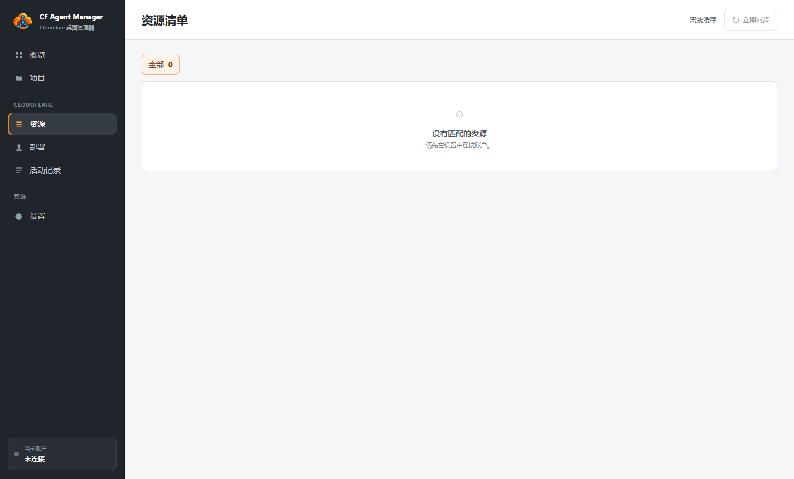
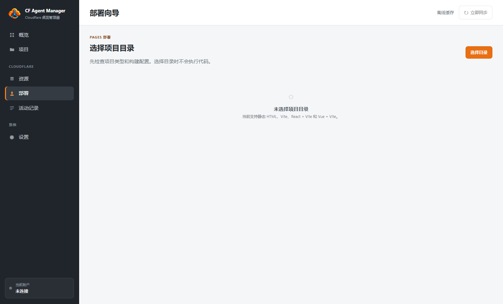

# CF Agent Manager

Windows 本地 Cloudflare 控制平面桌面应用。它把 Cloudflare 资源发现、缓存优先的 Dashboard、本地项目关系和受策略保护的部署校验放在一个中文优先的 Electron 界面中。

> 当前版本：`0.1.0`（早期公开预览）

## 界面预览






## 下载

从 [Releases](https://github.com/rowanjove/cf-agent-manager/releases) 下载最新的 Windows x64 ZIP，解压后运行 `CF Agent Manager.exe`。当前发布包未签名，Windows 可能显示 SmartScreen 提示；请只从本仓库的 Release 页面下载。

## 已实现能力

- 中文默认界面，可即时切换 English，语言偏好保存在本地 SQLite。
- 发现并缓存 Pages、Workers、D1、KV、R2、Zones、DNS 资源。
- 本地 Project 创建、Resource adopt 确认令牌和 Activity 审计基础。
- 部署向导的目录选择、项目分析、本地构建校验和执行前确认。
- API Token 只写入 Windows Credential Manager，不进入 SQLite、日志或构建子进程环境。
- 单个 Cloudflare 服务同步失败时保留其他已成功缓存的数据。

## 当前边界

这是一个可运行的第一条垂直切片，不是完整的 Cloudflare 管理后台。当前尚未实现 Cloudflare 写操作、Pages Direct Upload、sidecar Node/Wrangler 打包，以及干净 Windows 机器验收。应用会明确拒绝未满足条件的构建，不会用 mock 假装完成这些能力。

完整产品约束见 [DESIGN-R4.md](DESIGN-R4.md)，落地状态见 [IMPLEMENTATION-PLAN.md](IMPLEMENTATION-PLAN.md)，链路验证记录见 [CHAIN-VERIFICATION.md](CHAIN-VERIFICATION.md)。

## 安全说明

首次启动后，可在“设置”中输入 Cloudflare API Token。Token 仅用于发现账户并保存到 Windows Credential Manager；应用不会把 Token 写入 SQLite、Activity Log、项目 YAML 或日志。请使用权限范围尽可能小的 Cloudflare API Token，并不要把真实 Token 提交到仓库或 Issue。

## 本地开发

要求 Node.js `>=22.14`，建议使用 Windows 环境：

```powershell
npm install
npm test
npm run typecheck
npm run dev
```

常用验证命令：

```powershell
npm run build       # 构建 Electron 主进程、preload 和 renderer
npm run smoke:ui    # 构建并运行无凭据 UI smoke test
npm run pack:win    # 生成 release/CF-Agent-Manager-<version>-windows-x64.zip
```

## 项目结构

- `src/main`：Electron 主进程、安全策略和 IPC
- `src/preload`：受限的 renderer bridge
- `src/renderer`：中文优先的界面与本地化
- `src/core`：领域模型、同步、策略和部署分析
- `src/providers/cloudflare`：Cloudflare API client 与资源适配器
- `tests`：Vitest 单元/集成测试

## 参与贡献

欢迎提交 Issue 和 Pull Request。涉及 Cloudflare 写操作、凭据、DNS、密钥或破坏性动作的改动，请先说明权限边界、确认流程和测试覆盖；不要在 Issue、日志或测试 fixture 中放入真实凭据。

## 许可证

本项目以 [MIT License](LICENSE) 开源。Electron、Cloudflare API 及其他依赖仍受其各自许可证约束。
